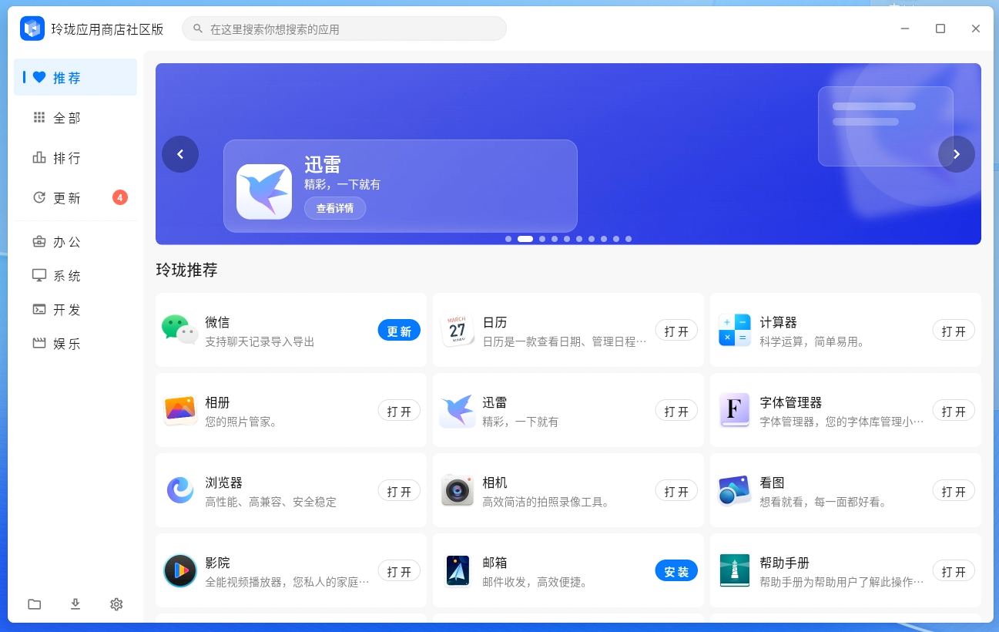

# Linglong App Store (Flutter Version)

> A modern Linux desktop application store built with Flutter - migrating from Tauri/React with pixel-perfect UI consistency and equivalent business logic.


## 🌟 Project Highlights

- **Linux Desktop Focus**: Dedicated to improving Linux desktop app ecosystem
- **Modern Architecture**: Flutter + Riverpod + Clean Architecture (Presentation → Application → Domain ← Data ← Platform)
- **High Performance**: Optimized for responsive UI with Flutter's rendering engine
- **Pixel-Perfect Migration**: UI consistency with previous Tauri/React version
- **Active Development**: Regular updates with clear roadmap and documentation

## 🎯 Project Vision

Provide a beautiful, fast, and reliable app store experience for Linux desktop users, offering seamless app discovery, installation, and management.

## 📥 Download & Installation

> If you just want to use Linglong App Store (rather than develop it), grab a prebuilt package — no need to build from source.

Supported architectures: amd64 / arm64 / loong64. Package formats: deb / rpm / AppImage / bundle.

### Stable Release (Recommended)

Recommended for most users. Latest version: [](https://github.com/HanHan666666/flutter-linglong-store/releases/latest)

- **Download packages**: [GitHub Releases (Latest)](https://github.com/HanHan666666/flutter-linglong-store/releases/latest)
- **Arch Linux (AUR)**:

  ```bash
  paru -S linglong-store-bin
  # or yay -S linglong-store-bin
  ```

### Nightly Build (Daily)

Auto-built from master every day with the latest features, but **may be unstable**. Nightly shares the install path with the stable release and the **two cannot coexist** (uninstall the stable version before installing Nightly).

- **Download packages**: [GitHub Releases (Nightly pre-releases)](https://github.com/HanHan666666/flutter-linglong-store/releases)
- **Arch Linux (AUR)**:

  ```bash
  paru -S linglong-store-nightly-bin
  # or yay -S linglong-store-nightly-bin
  ```

## 📋 Environment Requirements

- **Flutter SDK** (Latest stable version)
- **Dart SDK**
- **Linux Desktop Environment**
- **ll-cli** (Linglong command-line tool for system operations)

## 🚀 Quick Start

### 1. Install Dependencies

```bash
flutter pub get
```

### 2. Generate Code Files

This project uses **Freezed** and **Riverpod** code generation tools. **You must generate code files before running the app**:

```bash
dart run build_runner build --delete-conflicting-outputs
```

> **Important**: Missing `.freezed.dart` or `.g.dart` files will cause compilation errors.
> Re-run this command whenever you modify files with `@freezed` or `@riverpod` annotations.

### 3. Run Application (Development Mode)

```bash
flutter run -d linux
```

### 4. Build Release Version

```bash
flutter build linux --release
```

## 🛠️ Common Commands

```bash
# Code generation (Freezed/Retrofit/Riverpod)
dart run build_runner build --delete-conflicting-outputs

# Static analysis
flutter analyze

# Run tests
flutter test

# Run single test file
flutter test test/unit/core/format_utils_test.dart

# Profile performance verification
flutter run -d linux --profile
```

## 📦 Package Building

```bash
# DEB package
time ./build/package-deb.sh

# RPM package
./build/package-rpm.sh

# AppImage package
./build/package-appimage.sh
```

## 🏗️ Architecture Overview

The project follows a layered architecture with clear dependency direction:

**Dependency Flow**: Presentation → Application → Domain ← Data ← Platform

### Architecture Layers

- **Presentation**: Pages and reusable widgets, Riverpod Providers read state and render UI
- **Application**: Business orchestration (Controllers/Services/Providers), handles startup flow, installation queue, update checks, etc.
- **Domain**: Pure models and Repository interfaces (Freezed immutable models)
- **Data**: Repository implementations, API/CLI data sources and output parsing
- **Platform**: `ll-cli` executor, process management, window management, single-instance, optional Rust FFI

### Key Architecture Files

- **Entry Point**: Initialization (single-instance, window, logging, storage, locale) in `main.dart`
- **Routing**: Uses `go_router`, centralized in `core/config/routes.dart`
- **State Management**: Riverpod for global state and reactive UI updates
- **Data Persistence**: Hive for local storage with optimized caching strategies

## 📚 Documentation

Comprehensive documentation is available in the `docs/` directory:

### Core Documentation

- **[Migration Plan](docs/01-migration-plan.md)** - Background and comparison with Tauri/React version
- **[Flutter Architecture](docs/02-flutter-architecture.md)** - Detailed architecture and directory structure
- **[UI Design Tokens](docs/03a-ui-design-tokens.md)** - Design system foundation
- **[Testing & Performance](docs/06-testing-and-performance-spec.md)** - Test coverage and performance requirements
- **[Runtime Sequences](docs/07-runtime-sequence-and-state-diagrams.md)** - Startup flow and state machines

### Development Guidelines

- **[CLAUDE.md](CLAUDE.md)** - Comprehensive development guidelines and coding standards
- **[CONTRIBUTING.md](CONTRIBUTING.md)** - Contribution guidelines for new contributors

## 🤝 Contributing

We welcome contributions from the community! See **[CONTRIBUTING.md](CONTRIBUTING.md)** for:

- How to contribute (Issues, Pull Requests)
- Development environment setup
- Code standards and conventions
- Conventional Commits guidelines
- PR review process

### Quick Contribution Tips

1. Fork & Clone the repository
2. Create a feature branch (`feat/your-feature`)
3. Make changes following our coding standards
4. Run `flutter analyze` and `flutter test` to verify
5. Submit a Pull Request with clear description

## 💬 Community & Support

- **💬 Community Discussion**: [bbs.deepin.org.cn](https://bbs.deepin.org.cn)
- **🐛 Bug Reports**: [GitHub Issues](https://github.com/HanHan666666/flutter-linglong-store/issues)
- **📧 Email**: Contact project maintainer via GitHub

## 🌍 Internationalization

The project supports multiple languages with locale-aware caching and UI localization.

## 📄 License

This project is licensed under the **MIT License** - see [LICENSE](LICENSE) for details.

## 🙏 Acknowledgments

- Deepin Community for continuous support and feedback
- Flutter Team for the excellent framework and tools
- All contributors who help improve this project
