# 运行逻辑时序图与状态机图

> 文档版本: 1.0 | 创建日期: 2026-03-15  
> 目的：把迁移中最关键、最容易做错的运行逻辑，用可视化方式固定下来，避免多人开发时对真实行为理解不一致。

---

## 一、为什么这份文档必须存在

当前迁移文档已经有：
- 迁移方案
- Flutter 架构
- UI 设计规范
- 路线图
- 多人任务编排
- 测试与性能规范

但如果缺少**时序图**和**状态机图**，多人开发时仍然容易在以下地方“各写各的”：

1. 启动流程谁先谁后
2. 安装队列的状态流转
3. KeepAlive 页面的可见/隐藏行为
4. 搜索与分页的请求废弃策略
5. 更新检查与菜单红点刷新联动
6. 环境检测与自动安装逻辑

所以这份图文档不是“锦上添花”，而是**防止迁移走样的硬约束文档**。

---

## 二、启动流程时序图

> 启动链路的设计说明、首帧主题/语言恢复策略、启动关键路径与延后策略，
> 见：[`11-startup-flow-and-first-frame-restore.md`](./11-startup-flow-and-first-frame-restore.md)。

### 2.1 冷启动主流程

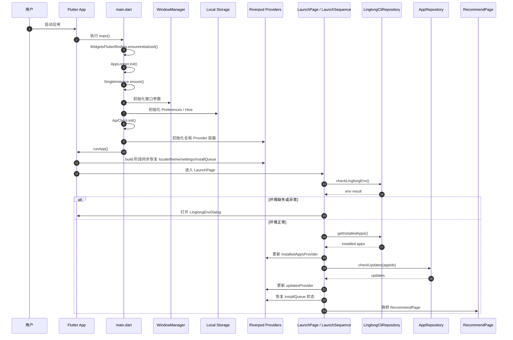

### 2.2 启动阶段约束

启动流程必须满足：
- 首帧只允许出现一个正式 `LaunchPage`
- 首帧主题和语言必须与用户上次保存的值一致
- `MaterialApp` 依赖的主题、语言、基础设置必须在 Provider `build()` 阶段同步恢复
- 已安装列表先于更新检查
- 更新检查先于菜单红点展示
- install queue 恢复必须在首页交互前完成
- 安装队列本地快照可在 Provider `build()` 恢复，但业务级纠偏仍必须在 `queueRecovery` 完成
- 设置页缓存大小等非关键路径逻辑不得阻塞启动
- 任何一步失败都要可诊断，不能静默吞掉

---

## 三、环境检测与自动安装时序图

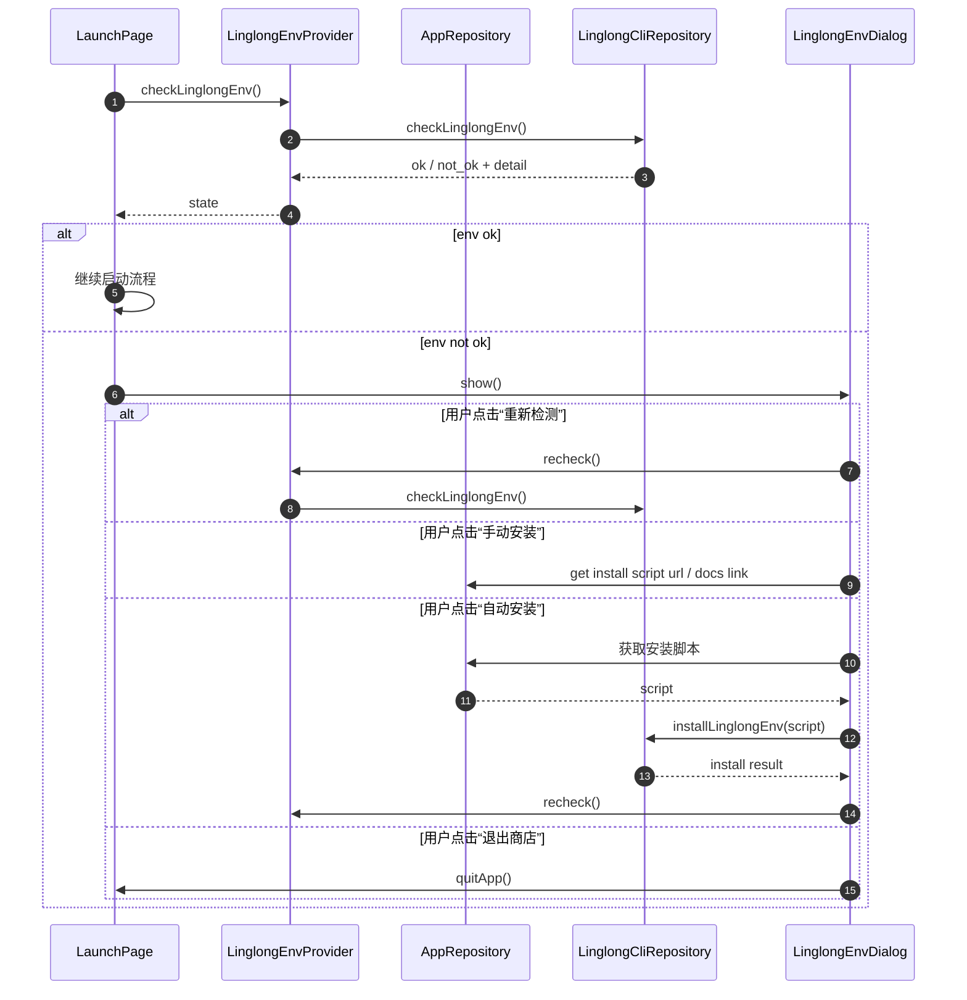

---

## 四、安装队列状态机

### 4.1 全局安装状态机

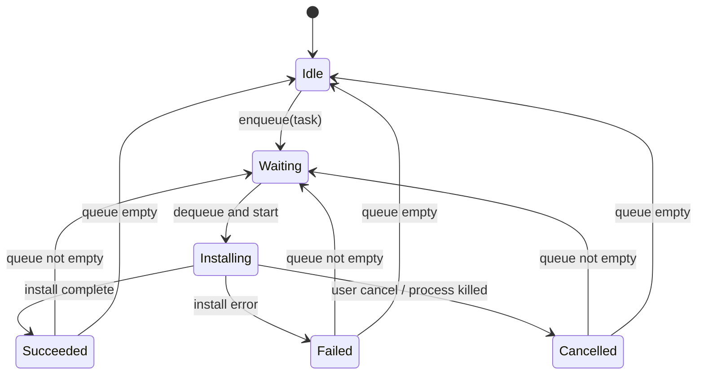

### 4.2 单任务状态机

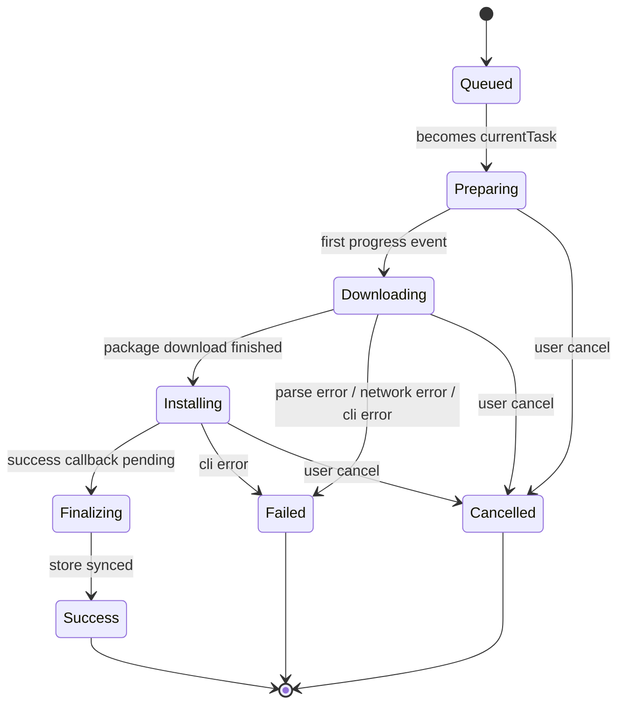

### 4.3 关键实现约束

- 同一时刻只允许 **1 个 currentTask**
- 队列推进必须由统一控制器负责，禁止页面各自改状态
- UI 只能读取 install queue，不允许页面直接驱动任务切换
- `Cancelled` 与 `Failed` 必须区分，不能混成一个“失败”

---

## 五、安装流程时序图

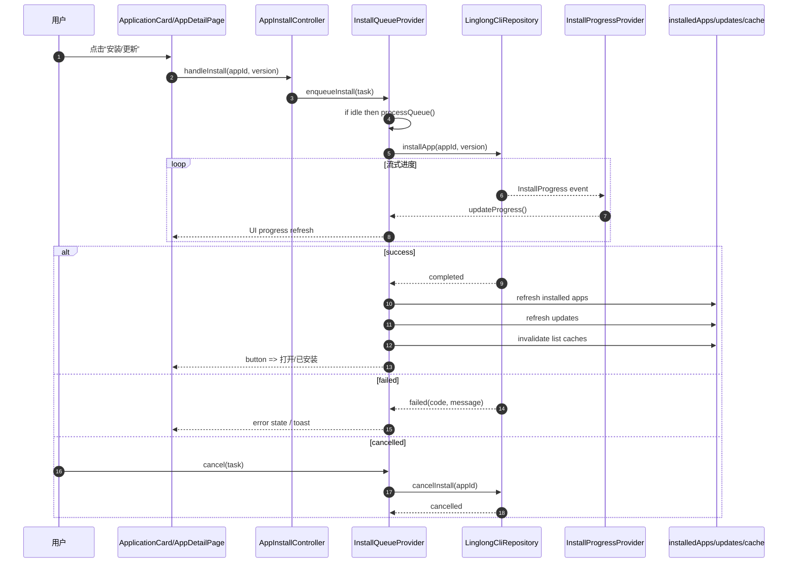

---

## 五-A、取消安装流程时序图

> 本节记录取消安装功能的设计，迁移自 Rust 版本的 `InstallSlot` 模式。

### 5-A.1 取消安装时序图

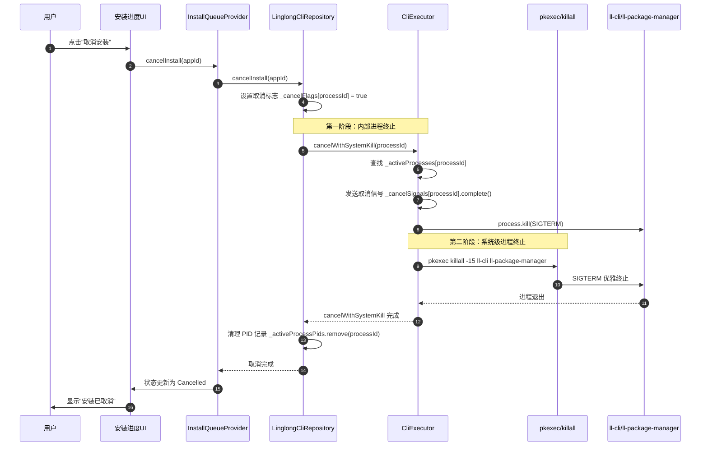

### 5-A.2 为什么需要系统级终止

Flutter 通过 `Process.start` 启动的子进程存在以下问题：

1. **进程树隔离**：`ll-cli` 会启动 `ll-package-manager` 作为子进程，Dart 的 `process.kill()` 只能终止直接子进程，无法终止孙子进程
2. **权限问题**：`ll-package-manager` 可能需要 root 权限运行，普通用户无法直接终止
3. **僵尸进程风险**：如果只终止 Dart 层面的进程引用，系统进程可能继续运行，导致资源泄露

**解决方案**（参考 Rust 版本）：
- 使用 `pkexec` 获取管理员权限
- 通过 `killall -15` 同时终止 `ll-cli` 和 `ll-package-manager`
- SIGTERM（信号 15）允许进程优雅退出，而非强制终止

### 5-A.3 取消状态管理

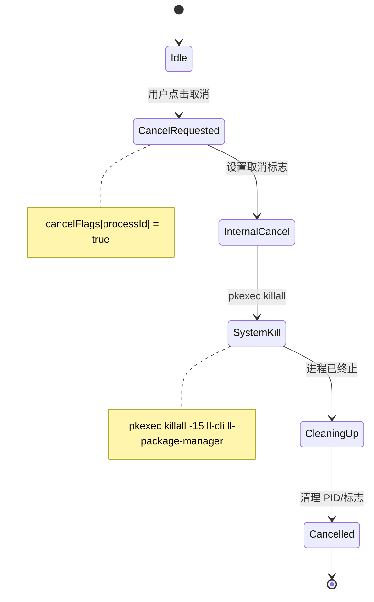

### 5-A.4 关键实现约束

1. **PID 记录时机**：必须在 `onProcessCreated` 回调中记录 PID，而非事后获取
   ```dart
   await for (final event in CliExecutor.executeWithProgressAndProcess(
     args,
     processId: processId,
     onProcessCreated: (process) {
       _activeProcessPids[processId] = process.pid;
     },
   )) { ... }
   ```

2. **双重取消机制**：
   - **标志位检查**：在流式处理循环中检查 `_cancelFlags[processId]`，实现快速响应
   - **系统级终止**：通过 `pkexec killall` 确保所有相关进程被终止

3. **取消与失败的区分**：
   - `InstallStatus.cancelled`：用户主动取消
   - `InstallStatus.failed`：安装过程出错
   - 两者不可混淆，UI 需要展示不同的提示信息

4. **资源清理顺序**：
   ```dart
   // 1. 设置取消标志
   _cancelFlags[processId] = true;
   // 2. 系统级终止
   await CliExecutor.cancelWithSystemKill(processId, ...);
   // 3. 清理 PID 记录
   _activeProcessPids.remove(processId);
   ```

### 5-A.5 从 Rust 迁移的设计要点

| Rust 设计 | Flutter 实现 | 说明 |
|-----------|-------------|------|
| `InstallSlot` 全局单例 | `CliExecutor._activeProcesses` 静态 Map | 管理活跃安装进程 |
| `is_cancelled` 标志 | `_cancelFlags` Map + `_isUserCancelled` | 区分取消与失败 |
| `pkexec killall -15` | `CliExecutor.cancelWithSystemKill()` | 系统级进程终止 |
| PID 记录 | `onProcessCreated` 回调 | 确保可靠获取进程 ID |
| `emit_cancelled()` 事件 | `_handleCancelledProgress()` | 处理取消状态传播 |

### 5-A.6 取消流程的关键实现细节

**1. 取消标志的双重同步**

为确保取消状态正确传播，Flutter 版本维护了两层取消标志：

```dart
// LinglongCliRepositoryImpl 中
final Map<String, bool> _cancelFlags = {}; // 进程级取消标志

// InstallQueue 中
bool _isUserCancelled = false; // 用户取消标志
```

当用户点击取消时：
1. `InstallQueue.cancelTask()` 调用 `markUserCancelled()` 设置用户取消标志
2. `LinglongCliRepositoryImpl.cancelInstall()` 设置 `_cancelFlags[processId] = true`
3. 安装流检测到 `_cancelFlags[processId] == true`，发送 `cancelled` 状态
4. `_handleProgress()` 检测到 `cancelled` 状态，调用 `_handleCancelledProgress()`

**2. 系统级终止的返回值处理**

`cancelWithSystemKill()` 返回值的判断逻辑：

```dart
// killall 返回码含义：
// 0 - 成功找到并终止进程
// 1 - 没有找到匹配的进程（进程可能已结束）
// 其他 - 权限问题或其他错误
if (result.exitCode == 0 || result.exitCode == 1) {
  systemKillSuccess = true;
}
```

**3. 取消与失败的区分**

- `InstallStatus.cancelled`：用户主动取消，由 `markUserCancelled()` 标记
- `InstallStatus.failed`：安装过程出错，由 `markFailed()` 处理
- 在 `markFailed()` 中检查 `isUserCancelled()` 决定最终状态

---

## 六、卸载流程时序图

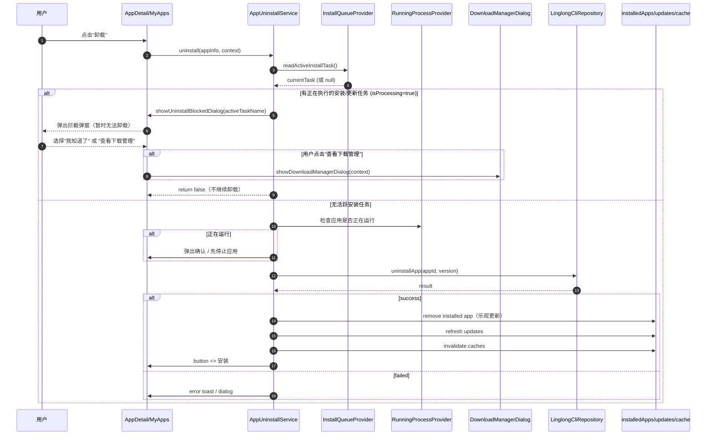

---

## 七、列表分页状态机

### 7.1 通用分页状态机

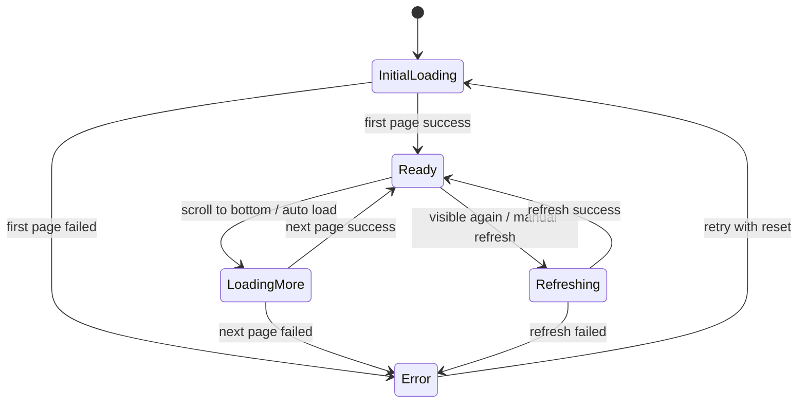

### 7.2 请求代次控制时序

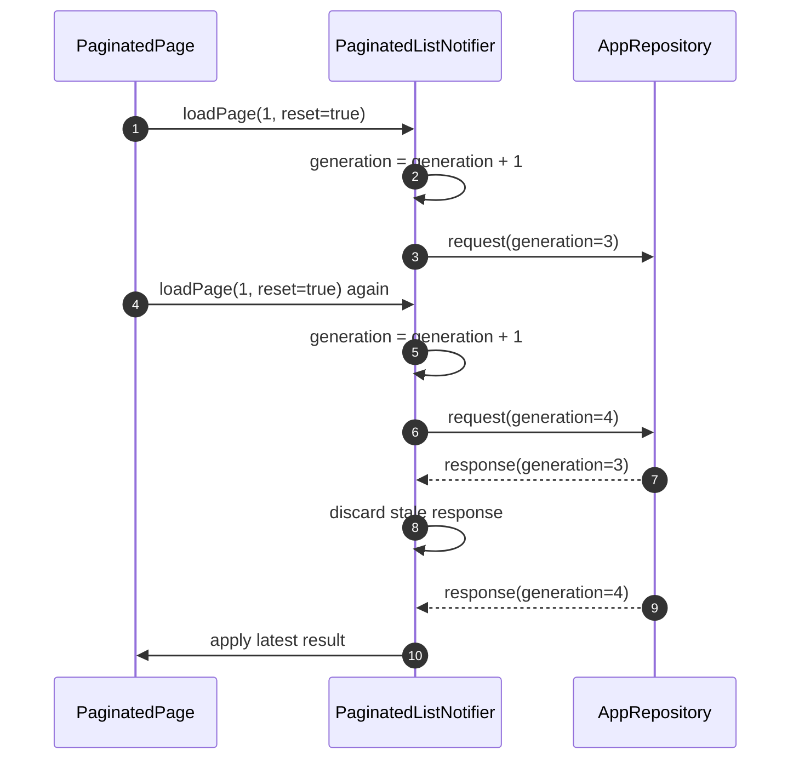

### 7.3 自动补页时序

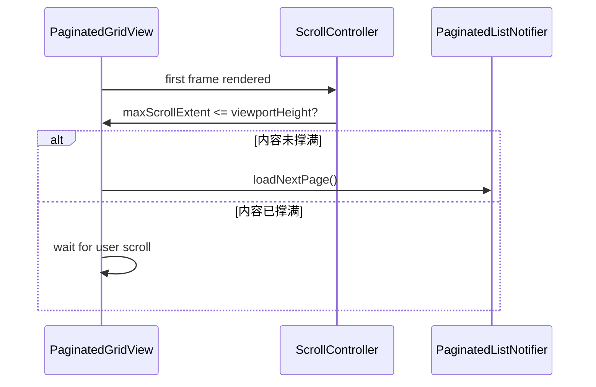

---

## 八、KeepAlive 可见性状态机

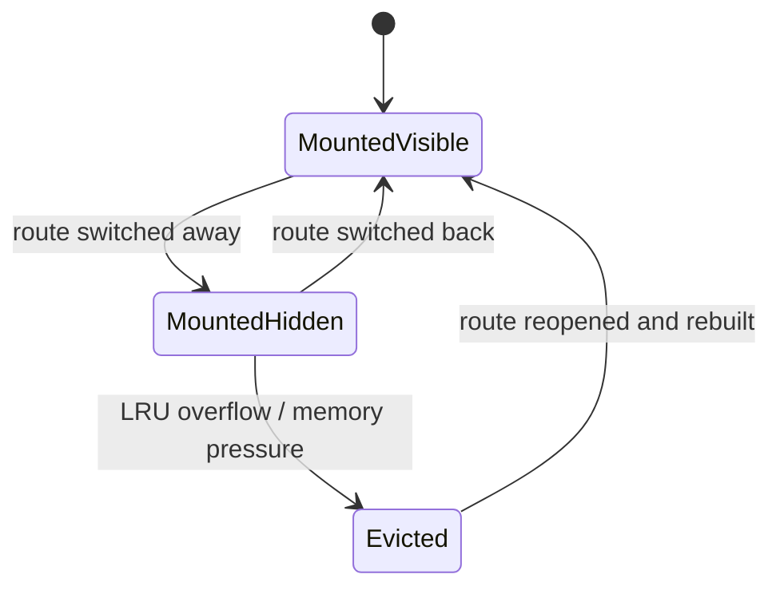

### 8.1 隐藏态行为约束

进入 `MountedHidden` 后必须暂停：
- 自动补页
- 滚动监听
- ResizeObserver 等效逻辑
- 轮询任务
- 高频动画
- 后台刷新定时器

恢复到 `MountedVisible` 时：
- 只允许一次轻量 refresh
- 不允许重新显示首屏骨架
- 不允许重置滚动位置（除非被 LRU 淘汰）

---

## 九、更新检查时序图

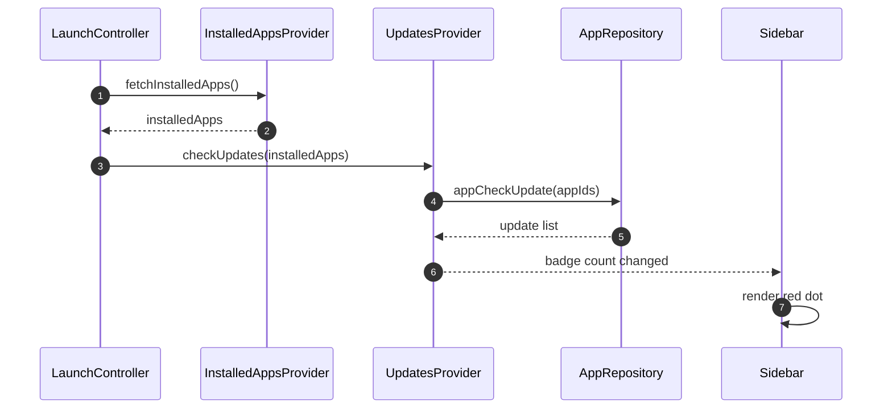

### 9.1 安装/卸载后的联动

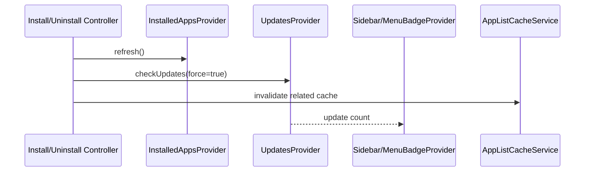

---

## 十、搜索流程时序图

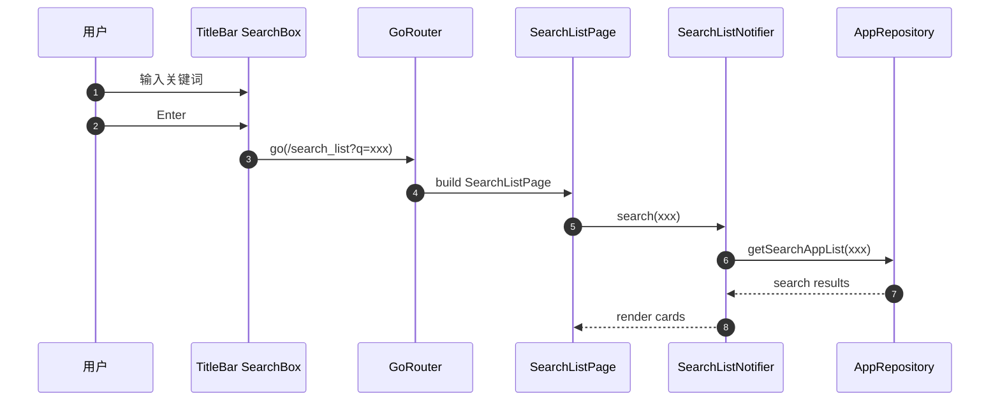

---

## 十一、运行中进程轮询状态机

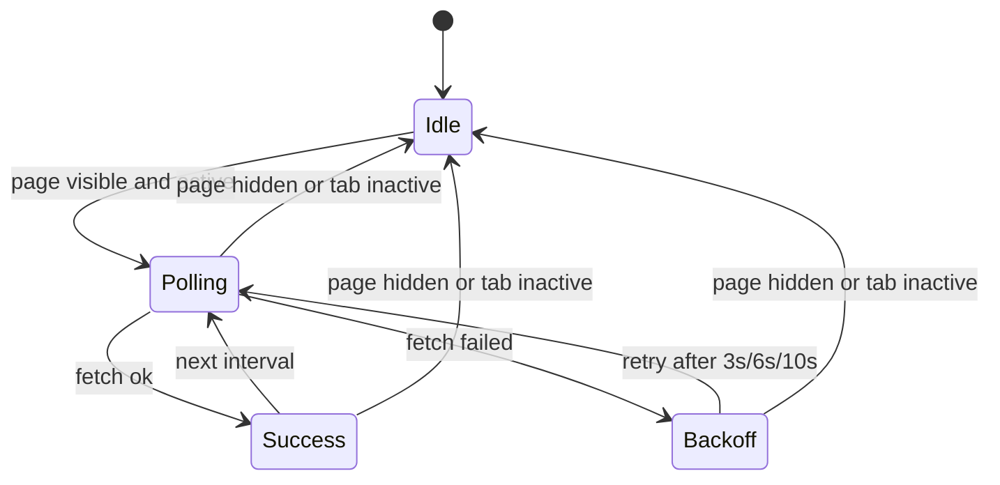

### 11.1 退避规则

- 第一次失败：3s 后重试
- 第二次失败：6s 后重试
- 第三次及以上：10s 后重试
- 页面隐藏时立即暂停轮询

---

## 十二、推荐补充图（后续可继续扩展）

如果你要把这套文档做成“交接即上手”的级别，后续还建议继续补：

1. **目录级依赖图**：core / application / presentation 模块依赖
2. **缓存结构图**：seed / runtime / visible-refresh 三层缓存关系
3. **Provider 依赖图**：哪些 Provider watch 哪些 Provider
4. **错误处理流转图**：用户提示、日志、上报、恢复策略
5. **窗口行为图**：最小化、最大化、关闭、托盘恢复

---

## 十三、结论

是的，**之前的文档确实缺少时序图和状态机图**，尤其对于：
- 安装队列
- KeepAlive
- 启动流程
- 搜索分页
- 更新红点联动
- 环境检测

这些地方如果没有图，多人开发时非常容易“逻辑各自脑补”。

现在这份文档补上之后，迁移资料完整度会明显上一个台阶：
- **方案**告诉你做什么
- **架构**告诉你怎么分层
- **UI 规范**告诉你怎么还原
- **路线图**告诉你怎么推进
- **任务规划**告诉你怎么多人协作
- **测试性能规范**告诉你怎么验收
- **时序图/状态机图**告诉你运行时到底怎么流转

这就比较像一套完整的迁移作战包了，而不是几篇散文。
