# 运行逻辑时序图与状态机图

> 文档版本: 1.0 | 创建日期: 2026-03-15  
> 目的：把迁移中最关键、最容易做错的运行逻辑，用可视化方式固定下来，避免多人开发时对真实行为理解不一致。

---

## 一、为什么这份文档必须存在

当前迁移文档已经有：
- 迁移方案
- Flutter 架构
- UI 设计规范
- 路线图
- 多人任务编排
- 测试与性能规范

但如果缺少**时序图**和**状态机图**，多人开发时仍然容易在以下地方“各写各的”：

1. 启动流程谁先谁后
2. 安装队列的状态流转
3. KeepAlive 页面的可见/隐藏行为
4. 搜索与分页的请求废弃策略
5. 更新检查与菜单红点刷新联动
6. 环境检测与自动安装逻辑

所以这份图文档不是“锦上添花”，而是**防止迁移走样的硬约束文档**。

---

## 二、启动流程时序图

### 2.1 冷启动主流程

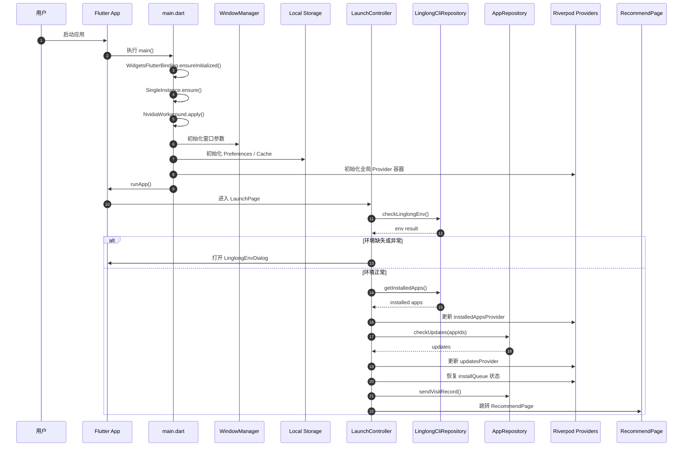

### 2.2 启动阶段约束

启动流程必须满足：
- 环境检测先于主内容渲染
- 已安装列表先于更新检查
- 更新检查先于菜单红点展示
- install queue 恢复必须在首页交互前完成
- 任何一步失败都要可诊断，不能静默吞掉

---

## 三、环境检测与自动安装时序图

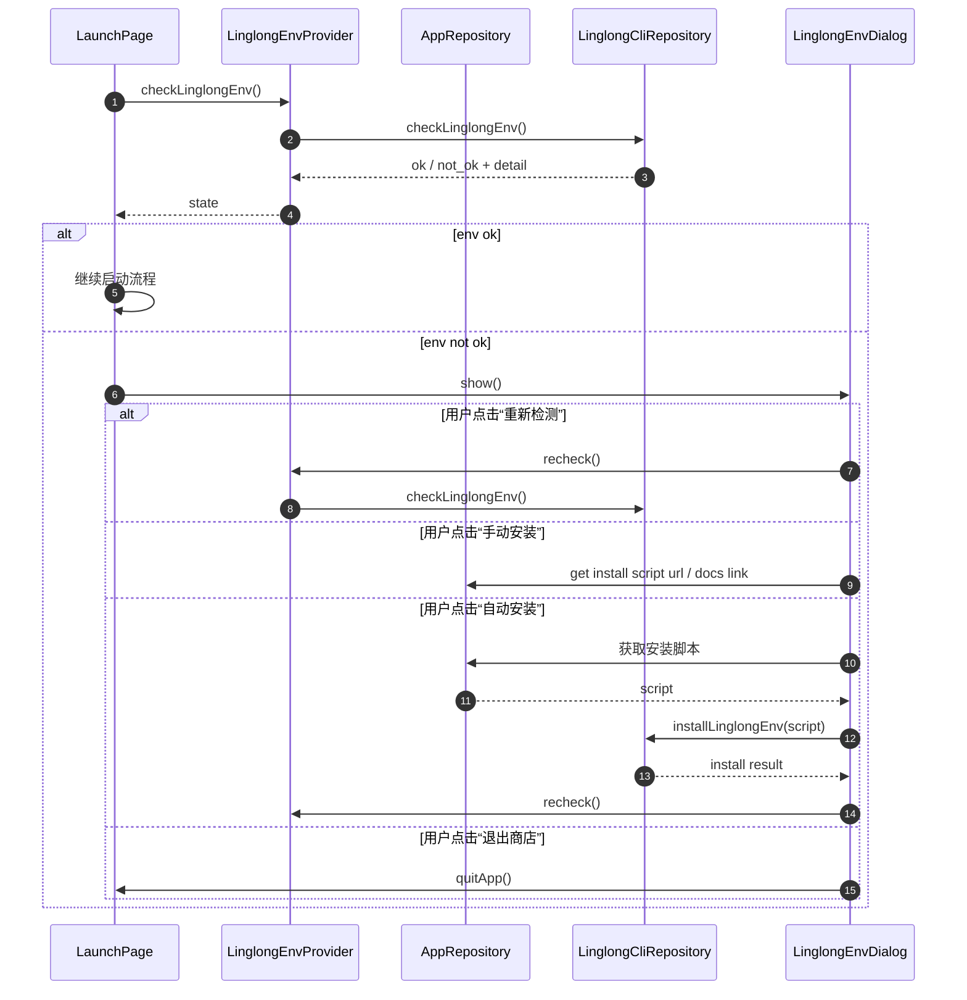

---

## 四、安装队列状态机

### 4.1 全局安装状态机

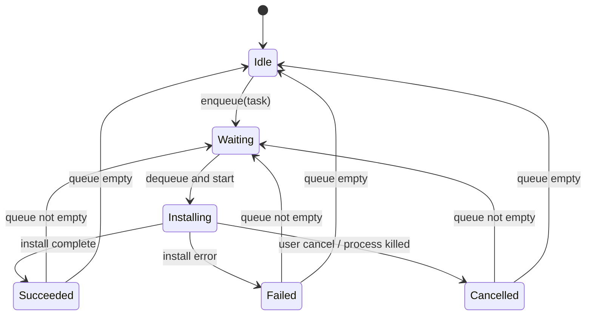

### 4.2 单任务状态机

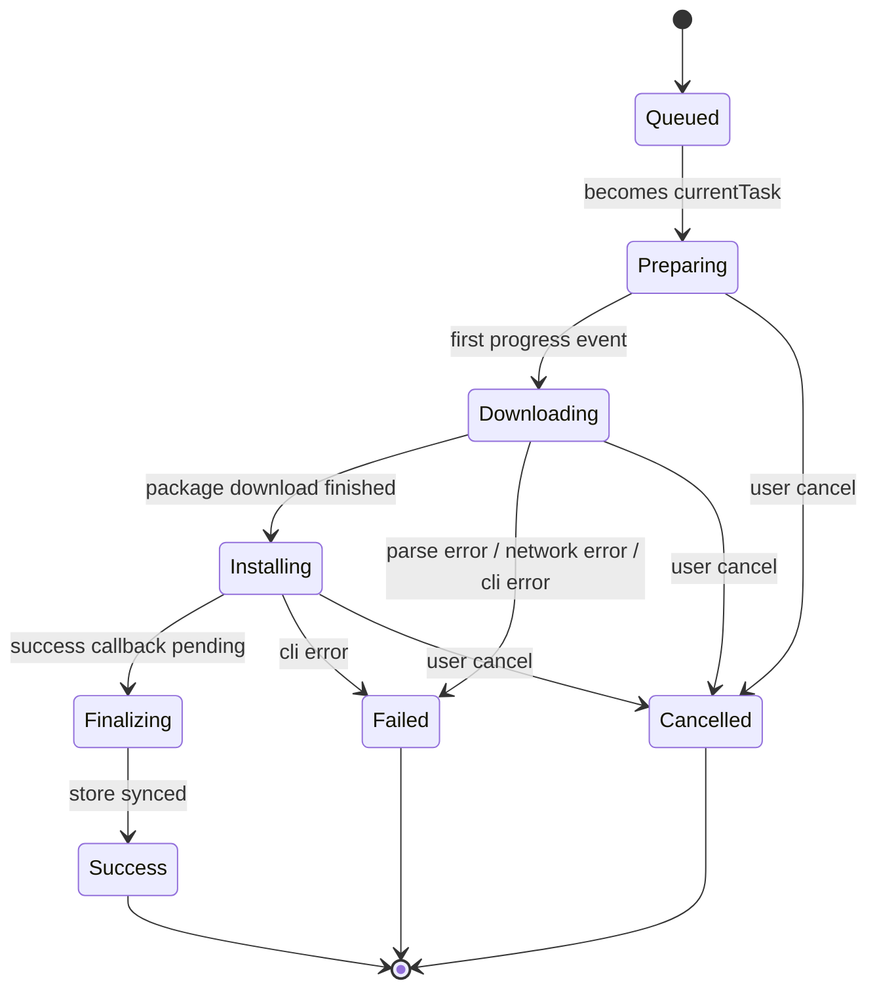

### 4.3 关键实现约束

- 同一时刻只允许 **1 个 currentTask**
- 队列推进必须由统一控制器负责，禁止页面各自改状态
- UI 只能读取 install queue，不允许页面直接驱动任务切换
- `Cancelled` 与 `Failed` 必须区分，不能混成一个“失败”

---

## 五、安装流程时序图

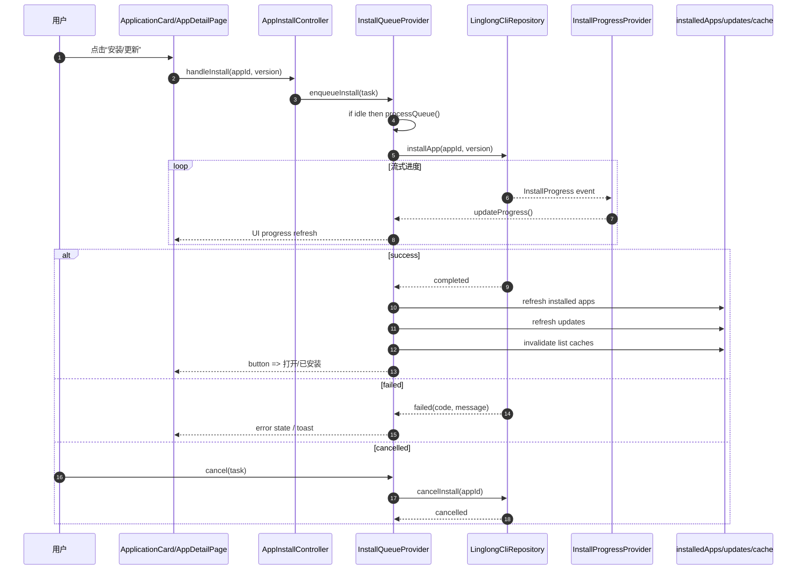

---

## 六、卸载流程时序图

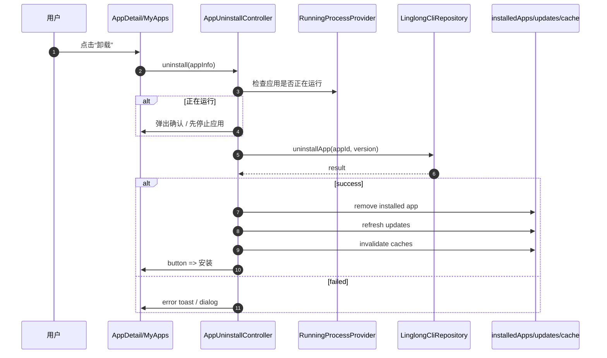

---

## 七、列表分页状态机

### 7.1 通用分页状态机

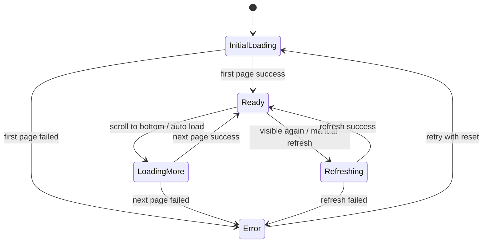

### 7.2 请求代次控制时序

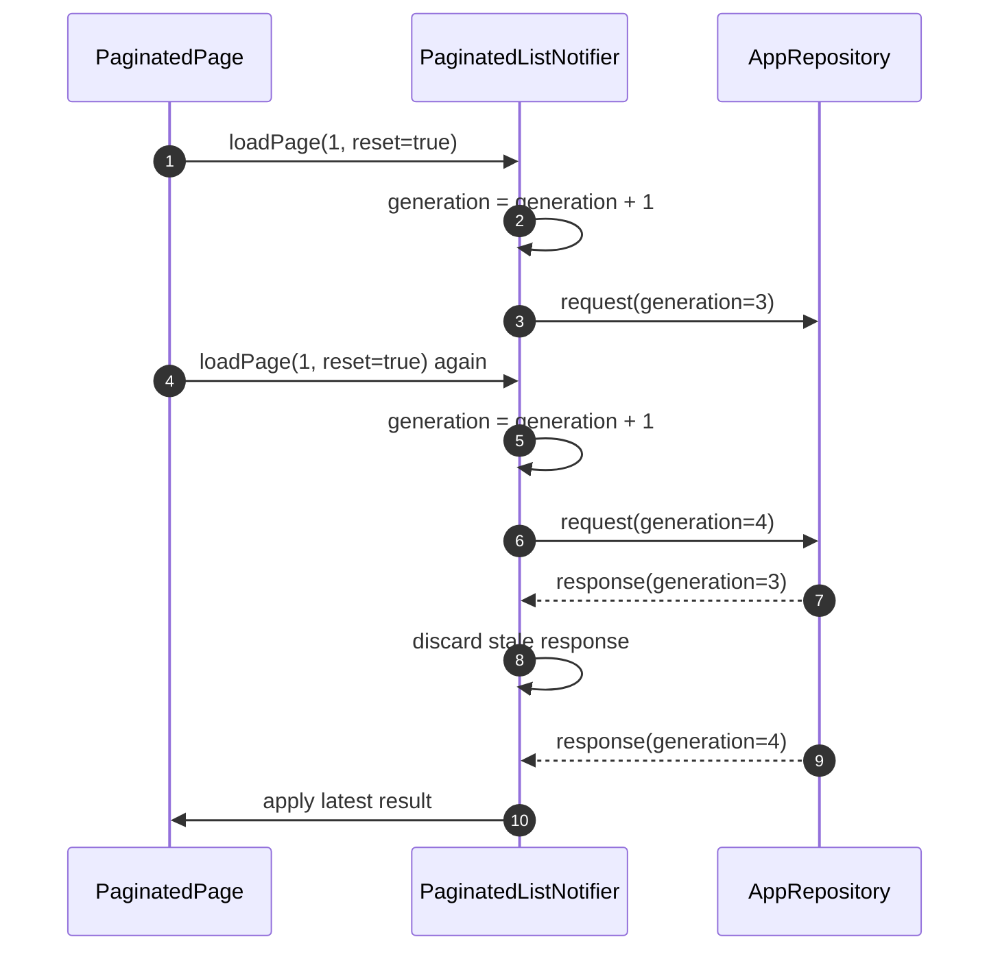

### 7.3 自动补页时序

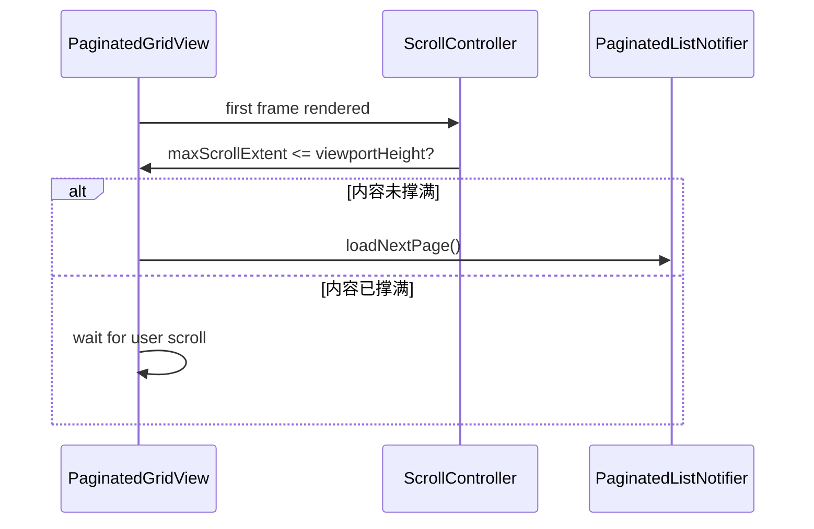

---

## 八、KeepAlive 可见性状态机

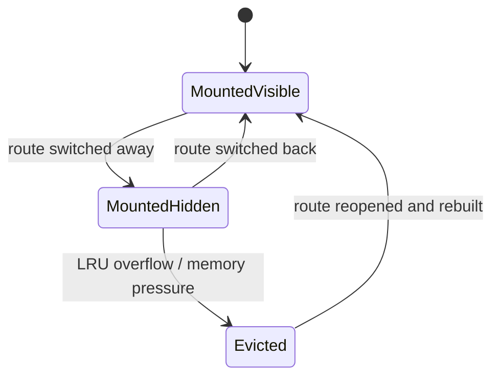

### 8.1 隐藏态行为约束

进入 `MountedHidden` 后必须暂停：
- 自动补页
- 滚动监听
- ResizeObserver 等效逻辑
- 轮询任务
- 高频动画
- 后台刷新定时器

恢复到 `MountedVisible` 时：
- 只允许一次轻量 refresh
- 不允许重新显示首屏骨架
- 不允许重置滚动位置（除非被 LRU 淘汰）

---

## 九、更新检查时序图

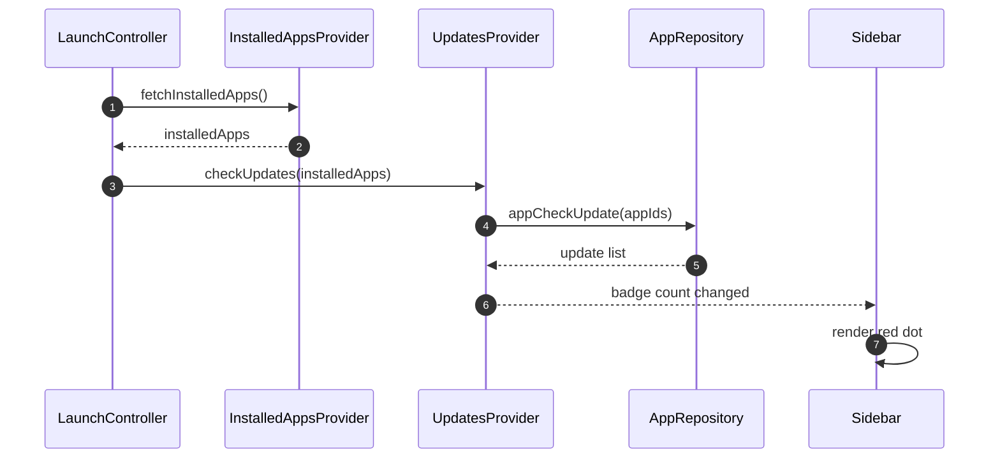

### 9.1 安装/卸载后的联动

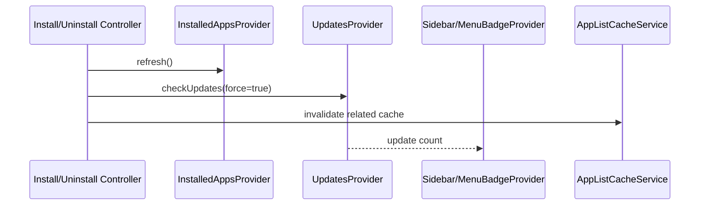

---

## 十、搜索流程时序图

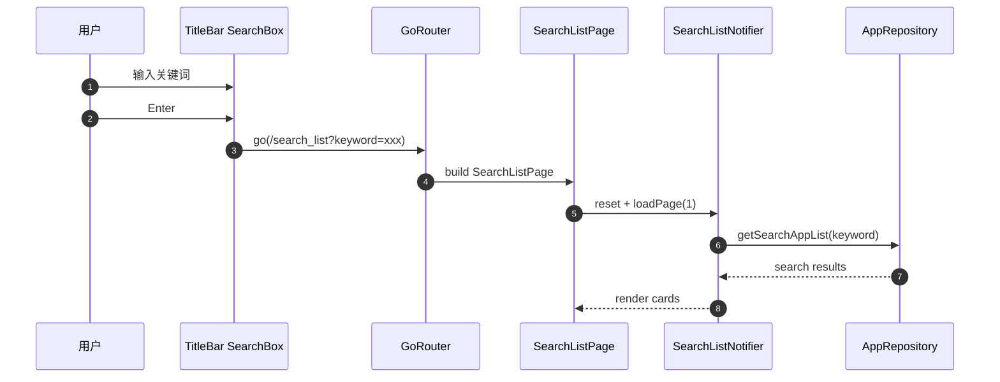

---

## 十一、运行中进程轮询状态机

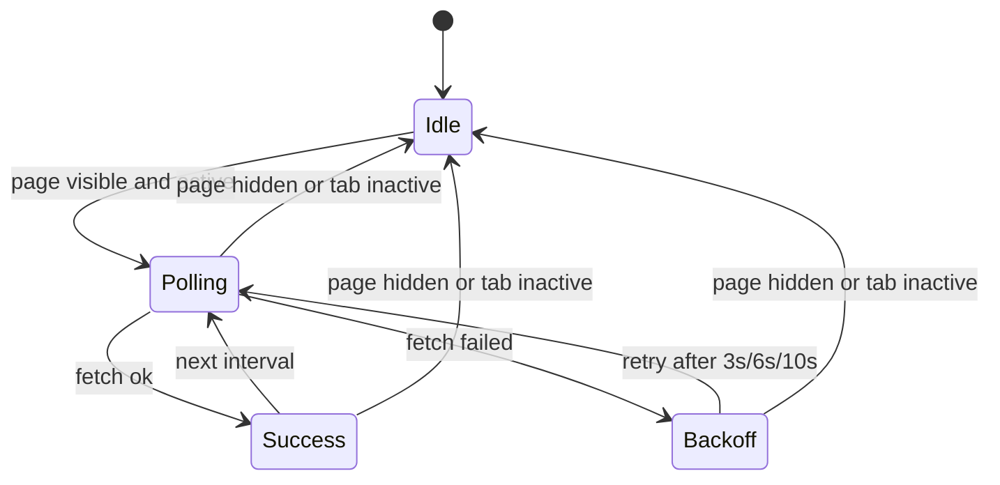

### 11.1 退避规则

- 第一次失败：3s 后重试
- 第二次失败：6s 后重试
- 第三次及以上：10s 后重试
- 页面隐藏时立即暂停轮询

---

## 十二、推荐补充图（后续可继续扩展）

如果你要把这套文档做成“交接即上手”的级别，后续还建议继续补：

1. **目录级依赖图**：core / application / presentation 模块依赖
2. **缓存结构图**：seed / runtime / visible-refresh 三层缓存关系
3. **Provider 依赖图**：哪些 Provider watch 哪些 Provider
4. **错误处理流转图**：用户提示、日志、上报、恢复策略
5. **窗口行为图**：最小化、最大化、关闭、托盘恢复

---

## 十三、结论

是的，**之前的文档确实缺少时序图和状态机图**，尤其对于：
- 安装队列
- KeepAlive
- 启动流程
- 搜索分页
- 更新红点联动
- 环境检测

这些地方如果没有图，多人开发时非常容易“逻辑各自脑补”。

现在这份文档补上之后，迁移资料完整度会明显上一个台阶：
- **方案**告诉你做什么
- **架构**告诉你怎么分层
- **UI 规范**告诉你怎么还原
- **路线图**告诉你怎么推进
- **任务规划**告诉你怎么多人协作
- **测试性能规范**告诉你怎么验收
- **时序图/状态机图**告诉你运行时到底怎么流转

这就比较像一套完整的迁移作战包了，而不是几篇散文。