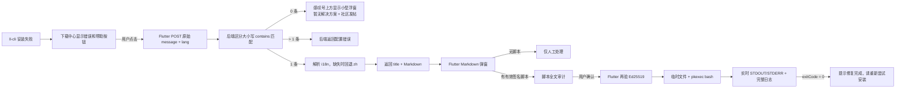

# 安装失败诊断与引导修复设计方案

> 更新日期：2026-07-26
> 涉及仓库：`flutter-linglong-store`、`linglong-server`、`linglong-admin`
> 文档状态：已实施并通过三端定向验证

## 一、背景

下载中心执行安装或更新时，`ll-cli --json` 可能返回：

```json
{"code":-1,"message":"Failed to connect signal: RequestInteraction"}
```

当前客户端只能展示错误文本，用户不知道错误原因，也不知道应该如何修复。把问题匹配规则和修复脚本写死在 Flutter 客户端，会导致每次新增、调整或下线解决方案都必须发布新客户端。

本功能把解决方案放到后端维护：

1. 下载中心在失败信息旁始终展示帮助按钮。
2. 用户主动点击帮助按钮时，Flutter 才把 `ll-cli` 的原始 `message` 和当前语言发送给后端。
3. 后端用 `message` 匹配一条已启用的解决方案。
4. 客户端使用 Markdown 展示后端返回的可读说明。
5. 解决方案包含修复脚本时，用户可以先审计脚本全文，再通过 `pkexec` 执行。
6. 执行期间实时展示 STDOUT 和 STDERR，并把完整输出写入本地日志。
7. 没有匹配方案时，不打开方案弹窗；在感叹号上方显示可交互的小型浮窗，引导用户前往玲珑社区发帖。

该能力的核心目标是让解决方案可以在后端上线、下线和更新，同时保证 root 脚本只能在用户明确审计、确认后执行。

## 二、已确认的产品决策

以下内容是本需求的固定约束，实施时不得重新扩展为其他规则系统：

| 项目 | 决策 |
|---|---|
| 查询时机 | 只有用户点击失败信息旁的感叹号帮助按钮时才请求后端 |
| 无方案交互 | 不打开方案弹窗；在感叹号上方显示“暂无解决方案”小型浮窗和“社区发帖”按钮 |
| 客户端缓存 | 不缓存、不持久化解决方案；每次点击重新请求 |
| 查询统计 | 只在本接口通过 `X-Visitor-Id` 携带匿名标识，用于去重计数和安排问题处理优先级 |
| 匹配输入 | 只使用 `ll-cli` JSON 中的原始 `message` |
| 请求大小 | `message` 按 UTF-8 文本接收，最大 8 KiB |
| 匹配方式 | 区分大小写的 `contains` 子串匹配 |
| 错误码 | 不参与匹配，也不上传 |
| 规则版本 | 不设计 |
| 匹配优先级 | 不设计 |
| 多条命中 | 返回配置错误，不选择其中任何一条 |
| 方案正文 | 后端返回一段完整 Markdown |
| Markdown 图片 | 支持 HTTP/HTTPS 远程图片 |
| 多语言 | 复用后端现有 `i18n` 表；请求语言不存在时只回退中文 `zh` |
| 修复脚本 | 可以为空；为空时只展示人工解决方案 |
| 脚本超时 | Flutter 固定控制为 30 分钟，数据库不保存超时 |
| 成功标准 | 修复脚本进程退出码等于 `0` |
| 成功行为 | 提示“修复完成，请重新尝试安装”，不自动重试安装 |
| 脚本审计 | 执行前必须展示即将执行的脚本全文 |
| 执行输出 | 实时展示 STDOUT/STDERR，完整输出同时写入日志 |
| 签名算法 | 只支持 Ed25519 |
| 私钥 | 不进入任何代码仓库；已生成到代码库外的受限目录，由负责人转移保存 |
| 公钥 | 可以进入代码和后端配置；它是信任根但不是秘密 |
| 审计字段 | 不保存审计人、审计时间或审计记录 |

## 三、范围

### 3.1 本次范围

- 后端解决方案表、实体、匹配服务和接口。
- 后端现有 `i18n` 表的复用与中文回退能力。
- 管理后台的解决方案增删改查、启用和停用。
- 通用 Ed25519 内容签名约定。
- 不联网的离线静态签名页面。
- Flutter 感叹号帮助按钮、按需查询、无方案小型浮窗和 Markdown 方案弹窗。
- Flutter 脚本签名复验、脚本全文审计、`pkexec` 执行。
- Flutter 实时 STDOUT/STDERR 展示、完整日志和结果反馈。
- `RequestInteraction` 的第一条后端解决方案数据。

### 3.2 本次不处理

- 不修改现有 `/app/findShellString` 玲珑环境安装脚本读取流程。
- 不处理现有公开写接口 `/app/updateShellString`；该安全问题已经记录，后续单独修复。
- 不把玲珑环境安装脚本接入本次签名和审计流程。
- 不提交、上传或由服务端保存正式私钥。
- 不做本地诊断规则、本地修复脚本或离线解决方案。
- 不自动重试失败的安装或更新任务。
- 不做规则版本、发布版本、灰度、优先级、客户端适配和解决方案缓存。
- 不提供多种签名算法、`keyId` 或自动密钥轮换。
- 不允许管理后台或数据库动态修改客户端信任的公钥。

## 四、现状依据

### 4.1 Flutter 错误来源

`ll-cli` 的失败 JSON 经过以下链路进入下载中心：

```text
ll-cli --json 输出
  ↓
CliOutputParser / LinglongCliRepositoryImpl
  ↓
InstallProgress.rawMessage / errorDetail
  ↓
InstallTask.errorDetail
  ↓
DownloadManagerDialog._buildErrorText()
```

`InstallTask.errorMessage` 可能被转换为更易读的展示文案，或附加发行版提示；`InstallTask.errorDetail` 保存失败 JSON 中解析出的原始 `message`。因此诊断请求必须读取 `errorDetail`，不能把已经本地化或增强后的 `errorMessage` 当成匹配输入。

如果旧任务没有 `errorDetail`，可以使用 `displayRawMessage` 取得原始消息；两者都不存在时不发请求，直接提示无法取得诊断信息。

### 4.2 可复用的 Flutter 能力

- `ShellCommandExecutor` 已负责进程启动、超时、STDOUT/STDERR 捕获和日志写入。
- `AppXdgPaths.resolveLogsDirectoryPath()` 已统一日志目录。
- `LocalPathOpener` 已支持打开日志所在目录。
- `CopyableCommandBlock`、`SelectableText`、通知组件可以复用。
- `A11yFocusScope` 和无障碍按钮组件可以用于新弹窗。

`ShellCommandExecutor` 已在原有接口旁增加兼容的流式能力；不支持流式的既有测试替身继续走最终结果回放，生产执行器仍保持唯一的 `Process.start` 实现。

### 4.3 后端多语言现状

后端已有 `i18n` 表和 `I18nService`：

```text
code  同一段内容的翻译键
lang  语言，例如 zh、en
value 对应语言的内容
```

解决方案业务表只保存标题和 Markdown 的 `i18n code`。真正的多语言内容继续保存在 `i18n` 表，不为每种语言增加业务表字段。

### 4.4 现有公开脚本接口

当前后端还有：

```http
GET  /app/findShellString
POST /app/updateShellString
```

它们维护的是 `ll_base_config.config_key = run_shell` 对应的玲珑环境安装脚本，与本需求不是同一业务。由于 `/app/**` 被公开放行，写接口目前也可以匿名调用。该问题必须后续独立处理，不能让新解决方案管理复用这个公开写入口。

## 五、总体架构



依赖方向保持现有项目约定：

```text
Flutter Presentation → Application → Domain ← Data ← Platform
```

UI 只负责显示状态和发送用户动作；网络解析、签名验证、脚本执行和日志处理分别收口到对应层。

## 六、后端数据设计

### 6.1 解决方案表

表名：

```text
ll_error_solution
```

字段保持最小化：

| 字段 | 类型 | 空值 | 说明 |
|---|---|---:|---|
| `id` | `BIGINT` | 否 | 自增主键，仅作为数据库关联标识 |
| `match_message` | `TEXT` | 否 | 用于匹配原始 `message` 的区分大小写子串 |
| `title_i18n_code` | `VARCHAR(100)` | 否 | 标题在 `i18n` 表中的 code |
| `markdown_i18n_code` | `VARCHAR(100)` | 否 | Markdown 正文在 `i18n` 表中的 code |
| `repair_script` | `LONGTEXT` | 是 | 一键修复脚本全文；为空表示仅人工方案 |
| `repair_script_signature` | `VARCHAR(128)` | 是 | Ed25519 签名的 Base64 文本 |
| `enabled` | `TINYINT(1)` | 否 | 是否参与匹配 |

不增加以下字段：

- error code；
- 规则版本；
- 优先级；
- 是否忽略大小写；
- 匹配类型；
- 超时时间；
- 签名算法；
- key ID；
- 审计人和审计时间；
- 创建时间和更新时间。

`id` 是普通数据库主键，不承担“稳定规则标识”或客户端协议语义。生成翻译 code 时使用：

```text
guided_repair_title_<id>
guided_repair_markdown_<id>
```

### 6.2 i18n 内容容量

Markdown 正文可能包含长文、代码块和远程图片链接，因此 `i18n.value` 必须能保存完整正文。数据库迁移统一把 `i18n.value` 扩展为 `LONGTEXT`，现有短文本内容不受影响。

新增或更新解决方案时，管理接口在一个事务内完成：

1. 保存 `ll_error_solution`。
2. 生成或复用该记录的两个 i18n code。
3. 更新标题翻译。
4. 更新 Markdown 翻译。

删除解决方案时，同一事务删除业务记录及其两个 code 对应的全部翻译，避免孤立数据。

### 6.3 多语言解析

在 `I18nService` 增加通用解析方法：

```java
String resolveValue(String code, String lang)
```

解析顺序固定为：

1. 查找请求的 `lang`。
2. 请求语言不存在或值为空时查找 `zh`。
3. 中文也不存在时返回空字符串。

不得随机返回数据库中的第一种语言。

Flutter 只上传 `Locale.languageCode`，例如 `zh`、`en`。后端不在解决方案表中保存语言，也不为中文和英文建立独立业务字段。

## 七、后端匹配与接口

### 7.1 公共查询接口

公共接口：

```http
POST /app/error-solution/find
Content-Type: application/json
Cache-Control: no-store
X-Visitor-Id: 1753500000000-a1b2c3d4e5f67890
```

请求：

```json
{
  "message": "Failed to connect signal: RequestInteraction",
  "lang": "zh"
}
```

约束：

- `message` 必填且去除空白后不能为空。
- `message` 的 UTF-8 编码结果最大 8192 字节；不能只按 Java 字符数量校验。
- `lang` 为空时按 `zh` 处理。
- 不接收 `errorCode`、客户端版本、发行版、架构等其他匹配字段。

`X-Visitor-Id` 是可选请求头，只用于统计有多少匿名客户端遇到同类错误，帮助后台
调整错误处理优先级。客户端复用既有 `analytics_visitor_id`，不读取账号、硬件序列号或
设备指纹；该 Header 只在 Retrofit 的 `findErrorSolution` 方法上声明，禁止放入 JSON
Body 或 Dio 全局拦截器。后端仅使用 visitorId 的 SHA-256 做 24 小时 Redis 去重，不把
原值写入数据库或日志；统计失败不得改变本接口响应。

单条命中响应：

```json
{
  "code": 200,
  "message": "执行成功",
  "data": {
    "title": "安装服务交互失败",
    "markdown": "# 解决方法\n\n完整 Markdown……",
    "repairScript": "#!/usr/bin/env bash\nset -euo pipefail\n...",
    "repairScriptSignature": "BASE64_ED25519_SIGNATURE"
  }
}
```

人工方案响应中：

```json
{
  "repairScript": null,
  "repairScriptSignature": null
}
```

零条命中返回成功且 `data = null`。客户端据此在感叹号上方展示“暂无解决方案”小型浮窗和“社区发帖”按钮，不打开方案弹窗。

多条命中返回业务失败，例如：

```text
解决方案配置错误：当前错误同时命中多条规则
```

不得按数据库顺序、主键或其他隐式规则选择其中一条。

### 7.2 匹配实现

服务加载全部 `enabled = 1` 的记录，在 Java 中执行：

```java
message.contains(solution.getMatchMessage())
```

这样匹配行为明确区分大小写，不依赖 MySQL 排序规则，也不需要增加“是否忽略大小写”字段。

匹配数量处理：

```text
0 条 → 返回 null
1 条 → 返回该方案
多条 → 抛出配置异常
```

方案查询不使用 Redis、本地缓存、HTTP ETag 或客户端缓存。每次点击都重新读取后端当前状态。

### 7.3 返回脚本前的验证

公共查询返回一条方案时：

- `repair_script` 为空：正常返回人工方案。
- 脚本非空且签名有效：返回脚本和签名。
- 脚本非空但签名缺失或无效：仍返回标题和 Markdown，但不返回脚本与签名。

因此错误的签名配置不会影响用户阅读人工解决方案，也不会让客户端出现可执行按钮。

### 7.4 管理接口

所有写操作必须位于需要登录认证的 `/admin/**`，不得放在公开的 `/app/**`：

```http
POST /admin/error-solution/page
GET  /admin/error-solution/detail/{id}
POST /admin/error-solution/save
POST /admin/error-solution/update
DELETE /admin/error-solution/delete/{id}
POST /admin/error-solution/set-enabled
```

管理请求同时携带业务字段和多语言列表，由解决方案 Service 统一编排并开启事务。控制器不得直接分别调用业务表和 i18n 表完成半套更新。

所有管理方法额外要求 `ROLE_admin`。Spring 方法级鉴权已显式启用，登录时从启用的 `sys_role` 装配权限；仅有默认角色的公开注册用户即使取得登录 Token，也不能调用这些接口。

启用规则：

- `match_message`、中文标题和中文 Markdown 必填。
- 人工方案可以在没有脚本和签名时启用。
- 有修复脚本的方案必须携带能够验证该脚本的签名才能启用。
- 修改脚本后，如果提交的签名不能验证新脚本，则清空旧签名并强制停用。
- 只修改匹配文本或多语言内容不使脚本签名失效，因为签名只覆盖脚本。

## 八、通用 Ed25519 签名

### 8.1 通用命名

签名能力不使用 `error-solution` 命名，因为后续玲珑环境安装脚本等模块也会复用。

建议通用名称：

```text
Trusted Content Signature
ContentSignatureVerifier
trusted-content-signature
offline-content-signer
```

业务模块通过 `purpose + content + signature` 调用通用验证器。

### 8.2 签名原文

签名只覆盖即将执行的 Shell 脚本，不覆盖标题、Markdown、匹配文本或数据库 ID。

签名输入固定为以下 UTF-8 字节：

```text
LINGLONG_STORE_SIGNED_CONTENT_V1
purpose=privileged-shell-script

<repair_script 的原始 UTF-8 字节>
```

其中前两行和空行属于签名协议，不保存到脚本字段，也不展示给用户。`purpose` 用于隔离不同用途，避免一个模块的签名内容被另一个模块误用。

脚本文本必须保持：

- UTF-8；
- BOM 若存在则作为正文原始字节保留；
- 不自动 `trim()`；
- 不转换 LF/CRLF；
- 不自动补删末尾换行；
- 签名后不再做任何字符规范化。

用户在审计弹窗看到的字符串、Flutter 写入临时文件的字符串、后端参与验签的字符串必须完全相同。

### 8.3 密钥和签名格式

只支持：

```text
算法：Ed25519
私钥输入：PKCS#8 PEM
公钥配置：Base64 编码的 32 字节 Ed25519 原始公钥
签名存储：Base64 编码的 64 字节 Ed25519 签名
```

不支持 RSA、ECDSA、OpenPGP、SSH 私钥、算法自动探测和多算法回退。

### 8.4 公钥信任

后端配置保存公钥文本，不要求公钥文件路径：

```yaml
trusted-content-signature:
  ed25519-public-key-base64: "BASE64_PUBLIC_KEY"
```

Flutter 内置同一把公钥。控制关系为：

- 后端部署和代码维护者控制后端公钥配置。
- Flutter 发布维护者控制客户端内置公钥。
- 即使后端公钥被替换，攻击者签出的脚本仍无法通过已发布客户端的本地验签。

公钥不是秘密，可以提交到代码库；但不得从解决方案表、普通管理接口或公共接口动态下发并直接信任。

本期不设计 `keyId` 和密钥轮换。未来更换公钥需要同时更新后端配置和 Flutter 客户端，作为单独发布任务处理。

### 8.5 私钥管理

私钥不进入 `flutter-linglong-store`、`linglong-server`、`linglong-admin` 或其他 Git 仓库。

正式 Ed25519 密钥已经生成在所有代码库之外：

```text
私钥：/home/han/.config/linglong-store/content-signing/ed25519-private.pem
公钥：/home/han/.config/linglong-store/content-signing/ed25519-public.pem
```

私钥权限为 `0600`。负责人应把私钥转移到受控保存位置，并自行决定是否删除开发机副本。

建议负责人保存到：

- 加密密码管理器；
- 加密离线介质；
- 权限为 `0600` 的受控本地文件。

取得代码权限不等于取得签名权限。

## 九、离线静态签名页面

在 `linglong-admin` 仓库新增：

```text
tools/offline-content-signer/
  index.html
  signer-core.js
```

该页面是独立工具，不进入 Vite 管理后台产物，也不请求后端。运行
`npm run build:offline-signer` 后会生成独立的
`dist-offline-content-signer/` 目录，复制整个目录到隔离设备即可使用。

页面流程：

1. 用户选择本地 PKCS#8 Ed25519 私钥。
2. 用户选择从管理后台导出的原始 `.sh` 文件，页面通过 `arrayBuffer()` 读取原始字节。
3. 页面完整显示脚本内容和字节长度，供再次确认。
4. 页面按通用签名协议构造签名输入。
5. 使用浏览器 Web Crypto 的 Ed25519 签名。
6. 输出 Base64 签名，可复制或下载为 `.sig`。
7. 用户回到管理后台粘贴或上传签名。

安全边界：

- 页面只支持 Ed25519。
- 私钥和脚本只存在于浏览器当前页面内存。
- 不写入 LocalStorage、IndexedDB、Cookie 或日志。
- 不上传私钥、脚本或签名。
- 不引用 CDN、统计脚本、字体或远程资源。
- CSP 设置 `connect-src 'none'`。
- 严格按 UTF-8 解码审计文本，解码后无法逐字节往返的文件直接拒绝签名。
- BOM、CRLF 和末尾换行均按文件原始字节进入签名信封。
- 页面刷新或关闭后清空内存状态。
- 浏览器不支持 Web Crypto Ed25519 时直接提示不支持，不回退到其他算法。

管理后台的“导出待签名脚本”必须按 UTF-8 原始字节下载，不能在导出时格式化脚本。签名上传后由后端立即验证，不能仅依赖离线页面显示“签名成功”。

## 十、管理后台

管理后台新增“错误解决方案”页面，包含：

- 列表：匹配文本、中文标题、是否有脚本、签名是否有效、启用状态。
- 新建和编辑：匹配文本、多语言标题、多语言 Markdown、修复脚本、签名。
- Markdown 编辑区提供预览，但保存内容仍是原始 Markdown。
- Markdown 预览延迟 150 ms 刷新，并使用显式标签/属性白名单；只允许 HTTP/HTTPS 链接和图片，不允许样式、表单、SVG、iframe 或事件属性。
- 脚本编辑区使用等宽字体并支持导出原始 `.sh`。
- 签名区支持粘贴 Base64 或选择 `.sig` 文件。
- 启用、停用和删除需要明确确认。

管理后台不读取私钥，也不实现在线签名。典型发布流程为：

```text
后台编辑并保存为停用
  → 导出脚本
  → 在隔离环境打开离线签名页
  → 选择私钥和脚本
  → 得到 Base64 签名
  → 回后台上传签名
  → 后端验签成功
  → 启用解决方案
```

修改脚本后，页面必须立即把旧签名状态显示为无效，并要求重新签名。修改 Markdown、标题或匹配文本不要求重新签名。

## 十一、Flutter 查询与展示

### 11.1 帮助入口

`DownloadManagerDialog._buildErrorText()` 调整为：

```text
完整错误文本 + 可聚焦的感叹号帮助按钮
```

约束：

- 当前失败任务和历史失败任务使用同一入口。
- 感叹号按钮紧跟在红色错误文字右侧，当前任务和历史任务保持一致。
- 帮助按钮始终显示，不在客户端预判是否存在方案。
- Tooltip、Semantics 和按钮文案全部走 Flutter l10n。
- 错误文本继续完整显示并支持现有复制语义。

### 11.2 点击后的状态

每次点击都创建一次独立请求状态：

```text
loading
solution
notFound
configurationError
networkError
```

- `loading`：显示加载状态。
- `solution`：渲染标题和 Markdown。
- `notFound`：不打开方案弹窗，在触发请求的感叹号上方显示可交互小型浮窗。
- `configurationError`：展示后端多条命中等配置错误，不执行任何脚本。
- `networkError`：提示加载失败并提供重试；不能把网络失败误认为没有方案。

关闭方案弹窗或提示浮窗后丢弃响应。再次点击感叹号必须重新请求后端。

#### 无解决方案小型浮窗

标准 Flutter `Tooltip` 只适合文字提示，不能承载可聚焦的链接按钮。本功能使用锚定在感叹号上方的轻量 Popover 模拟 Tooltip 的视觉效果：

```text
暂无解决方案
[社区发帖]
```

交互要求：

- 浮窗锚定在本次点击的感叹号上方，不能漂移到下载管理弹窗之外。
- “社区发帖”是可点击、可键盘聚焦的链接按钮，使用系统默认浏览器打开社区地址。
- 点击浮窗之外、再次点击感叹号或按 Escape 时关闭浮窗。
- 浮窗打开后把焦点移动到浮窗范围，关闭后把焦点还给原感叹号按钮。
- 浮窗本身使用 `A11yFocusScope`，文字和按钮都使用 l10n 与 Semantics。
- 不使用只能展示纯文字的标准 `Tooltip` 假装承载交互。

查询失败时复用同一个小型浮窗显示“查询失败，请重试”和“重试”按钮；它与 `notFound` 状态严格区分。

社区入口复用现有玲珑社区地址：

```text
https://bbs.deepin.org.cn/module/detail/230
```

实施时应把设置页现有硬编码地址提取为公共外链常量，避免多个页面各自维护。

### 11.3 Markdown

Flutter 增加 Markdown 渲染依赖，解决方案使用一段完整 Markdown 渲染，至少覆盖：

- 标题；
- 段落；
- 有序和无序列表；
- 引用；
- 粗体、斜体；
- 行内代码和代码块；
- 表格；
- 分隔线；
- 普通链接；
- HTTP/HTTPS 远程图片。

链接通过系统默认浏览器打开。图片仅允许网络 `http` 和 `https`，拒绝 `file:`、本地绝对路径和其他自定义协议。Markdown 中的 HTML 或脚本不执行。

解决方案 JSON 不在 `build()` 中解析，Markdown 的解析和布局只发生在方案弹窗内，不影响下载中心列表的正常滚动。

## 十二、脚本审计与执行

### 12.1 一键修复按钮

只有同时满足以下条件才显示“一键修复”：

- 后端返回非空 `repairScript`；
- 后端返回非空 `repairScriptSignature`；
- Flutter 使用内置公钥验签成功。

客户端验签失败时：

- 继续允许阅读 Markdown；
- 隐藏或禁用一键修复；
- 明确提示脚本签名无效；
- 不写临时文件，不调用 `pkexec`。

### 12.2 审计弹窗

用户点击“一键修复”后先进入 `ScriptReviewDialog`：

- 展示脚本全文，不折叠、不省略。
- 使用等宽字体和 `SelectableText`。
- 提供复制脚本按钮。
- 明确提示脚本将申请管理员权限。
- 提供“取消”和“确认并执行”。
- 弹窗使用 `A11yFocusScope`，支持键盘焦点和 Escape 取消。

用户确认后，执行服务再次对弹窗中同一个脚本字符串验签。两次验签分别保护“是否显示执行入口”和“最终执行内容”。

### 12.3 执行方式

执行步骤固定为：

1. 为本次执行创建 XDG 日志文件。
2. 把已经验签和审计的脚本原样写入权限受限的临时文件。
3. 调用统一的 `ShellCommandExecutor`：

   ```text
   pkexec timeout --signal=TERM --kill-after=10s 1800s bash <temporary-script-path>
   ```

4. Flutter 固定构造 30 分钟的特权侧 `timeout`，并用 30 分 30 秒本地看门狗保证异常管道也能收尾。
5. 实时接收 STDOUT 和 STDERR。
6. 进程退出后按退出码判断结果。
7. `finally` 删除临时脚本。

不得在写入前后调用 `trim()` 或重新拼接脚本。日志文件可以保留，临时脚本必须删除。

### 12.4 成功与失败

唯一成功条件：

```text
exitCode == 0
```

成功时显示：

```text
修复完成，请重新尝试安装。
```

客户端不自动重试原任务，也不自动重新加入安装队列。

以下情况均为失败：

- 用户取消 `pkexec` 授权；
- 进程无法启动；
- 退出码非 0；
- 执行超过 30 分钟；
- 执行前最终验签失败；
- 临时脚本或日志文件创建失败。

失败弹窗展示可读错误、实时输出和日志入口，不根据输出文本猜测成功。

## 十三、实时 STDOUT/STDERR

### 13.1 执行器扩展

在现有 `ShellCommandExecutor` 上增加流式事件，不创建第二个 Shell 执行器：

```dart
enum ShellOutputChannel { stdout, stderr }

class ShellOutputEvent {
  final ShellOutputChannel channel;
  final String line;
}
```

`ShellCommandRunner.run()` 增加可选输出回调或事件接收器。底层读取每个流时同时完成：

1. 追加有界的最终结果尾部缓冲区。
2. 写入完整日志。
3. 发出带通道信息的 UI 事件。

原有未传回调的调用保持现有行为，从而让环境管理等调用方无需同步改造。

### 13.2 执行输出弹窗

执行弹窗按事件到达客户端的顺序合并展示：

```text
[stdout] 正在刷新软件源……
[stderr] warning: ...
[stdout] 安装完成
```

不使用两个 Tab，因为分开显示会丢失用户排查问题时最有价值的时间关系。

弹窗提供：

- 当前执行状态；
- 已运行时间；
- 实时终端式输出；
- 自动滚动；
- 用户手动向上滚动后暂停自动滚动；
- “复制当前输出”；
- “打开日志目录”；
- 结束后的退出码和结果。

执行期间不提供会造成“界面已取消但 root 脚本仍在运行”误解的普通取消按钮。30 分钟超时由执行器统一处理。

### 13.3 性能和内存

脚本可能持续输出大量内容。为了保证 UI 响应：

- 完整 STDOUT/STDERR 始终逐行写入日志，不截断日志。
- 执行器最终结果每个通道只保留最近 64 KiB，错误摘要不会因高输出无限占用内存。
- UI 只保留最近 512 KiB 的滚动输出。
- 超过上限时从最早的完整行开始淘汰，并显示“较早输出请查看完整日志”。
- 流式事件在展示组件按最多每 100 ms 一批提交状态，避免每一行触发一次组件树重建。
- 输出列表使用 builder 或单个受控文本区域，不在 `build()` 中反复拼接全部历史内容。
- 关闭结果弹窗后释放输出缓冲区和滚动控制器。

## 十四、Flutter 模块边界

实际文件职责如下：

```text
lib/domain/models/
  error_solution.dart

lib/data/models/
  error_solution_dto.dart

lib/data/repositories/
  error_solution_repository_impl.dart

lib/domain/repositories/
  error_solution_repository.dart

lib/core/storage/
  visitor_identity_service.dart

lib/core/security/
  trusted_content_signature.dart

lib/core/platform/
  shell_command_executor.dart

lib/application/services/
  error_solution_lookup_service.dart
  guided_repair_service.dart

lib/application/providers/
  error_solution_provider.dart
  guided_repair_provider.dart

lib/presentation/widgets/
  error_solution_help_button.dart
  error_solution_dialog.dart
  script_review_dialog.dart
  guided_repair_execution_dialog.dart
  download_manager_dialog.dart
```

职责边界：

- Repository：请求后端并映射领域模型，不缓存。
- 签名验证器：只负责通用 `purpose + content + signature` 验证。
- GuidedRepairService：验签、临时文件、日志和执行编排。
- Provider：持有单次查询或单次执行状态。
- Dialog：只渲染状态和触发 Provider 方法。
- DownloadManagerDialog：只增加帮助入口，不包含网络或 Shell 逻辑。

## 十五、后端与管理端模块边界

### 15.1 linglong-server

```text
sql/
  migration_<date>_create_error_solution.sql

ll-server/src/main/java/com/dongpl/
  entity/ErrorSolution.java
  bo/ErrorSolutionFindBO.java
  bo/ErrorSolutionSaveBO.java
  bo/ErrorSolutionTranslationBO.java
  vo/ErrorSolutionVO.java
  vo/ErrorSolutionAdminVO.java
  mapper/master/ErrorSolutionMapper.java
  service/ErrorSolutionInputPolicy.java
  service/ErrorSolutionScriptPolicy.java
  service/ErrorSolutionService.java
  service/ErrorSolutionAdminService.java
  service/impl/ErrorSolutionServiceImpl.java
  service/impl/ErrorSolutionAdminServiceImpl.java
  controller/app/ErrorSolutionController.java
  controller/admin/ErrorSolutionAdminController.java
  security/ContentSignatureVerifier.java
  security/Ed25519ContentSignatureVerifier.java
  config/TrustedContentSignatureProperties.java
```

`ErrorSolutionService` 负责公共匹配与本地化；`ErrorSolutionAdminService` 负责事务保存和启停；`ErrorSolutionScriptPolicy` 负责脚本验签；`ErrorSolutionInputPolicy` 统一公共端与管理端的字节和语言边界。Controller 不复制这些规则。

### 15.2 linglong-admin

```text
src/api/errorSolution.ts
src/views/errorSolution/index.vue
src/router/index.ts
src/views/index.vue
src/types/constants.ts
tools/offline-content-signer/index.html
tools/offline-content-signer/signer-core.js
tools/offline-content-signer/signer-core.test.mjs
tools/offline-content-signer/build.mjs
tools/offline-content-signer/README.md
```

管理页面只调用 `/admin/error-solution/**`，不得调用公开 `/app/**` 写入数据。

## 十六、异常语义

| 场景 | 后端行为 | Flutter 行为 |
|---|---|---|
| message 为空或超过 8 KiB | 参数错误 | 显示无法诊断 |
| 无方案 | 成功，`data=null` | 感叹号上方显示“暂无解决方案”和“社区发帖”小型浮窗 |
| 单条人工方案 | 返回标题和 Markdown | 只展示方案 |
| 单条有效脚本方案 | 返回 Markdown、脚本和签名 | 验签后显示一键修复 |
| 多条命中 | 配置错误 | 显示错误，不执行 |
| 请求失败 | HTTP/网络错误 | 显示加载失败和重试 |
| 请求语言缺失 | 回退 `zh` | 正常展示中文 |
| Markdown 中文也缺失 | 配置错误或空内容失败 | 不展示空方案 |
| 后端脚本验签失败 | 不返回脚本 | 仍展示人工说明 |
| Flutter 脚本验签失败 | 无 | 禁止执行 |
| pkexec 被取消 | 无 | 显示授权已取消 |
| 退出码非 0 | 无 | 显示修复失败及退出码 |
| 30 分钟超时 | 无 | 显示超时，保留日志 |
| 退出码为 0 | 无 | 提示用户主动重试安装 |

## 十七、测试要求

### 17.1 后端

- `message` 为空和 UTF-8 编码结果超过 8192 字节时拒绝。
- 匹配区分大小写。
- 0 条、1 条和多条命中的行为。
- 禁用方案不参与匹配。
- 请求语言存在时返回对应翻译。
- 请求语言缺失时只回退 `zh`。
- 中文也缺失时不返回空白方案。
- 人工方案无需签名即可启用。
- 脚本方案没有签名、签名错误时不能启用。
- 修改脚本使旧签名失效并强制停用。
- 有效 Ed25519 签名可以启用并通过公共接口返回。
- 删除方案同时删除关联 i18n 内容。
- 管理写接口匿名访问返回未认证。
- 公共查询接口允许匿名只读访问。

### 17.2 离线签名页

- PKCS#8 Ed25519 私钥可以导入。
- 非 Ed25519 或无效私钥被拒绝。
- 签名结果可被后端和 Flutter 的同一测试向量验证。
- CRLF、末尾换行和任意一个字符变化都会导致验签失败。
- UTF-8 BOM 作为原始字节保留；非法 UTF-8 被拒绝。
- 页面不产生网络请求。
- 页面不使用浏览器持久化存储。

### 17.3 Flutter 单元测试

- 请求只包含原始 `message` 和 `lang`。
- 错误解决方案请求单独携带稳定的 `X-Visitor-Id`，其他接口不全局携带。
- 已存在 `analytics_visitor_id` 时必须原样复用，首次生成后后续请求保持稳定。
- 每次调用 Repository 都发起真实请求，不读写缓存。
- 后端 `null` 映射为无方案。
- 脚本签名有效、无效、Base64 非法的处理。
- 签名输入字节与后端测试向量一致。
- 执行前和最终执行时验证的是同一脚本文本。
- 退出码 0、非 0、授权取消、启动异常和超时。
- 临时文件在成功和异常路径都删除。
- STDOUT/STDERR 事件保留通道并写入完整日志。
- UI 输出滚动缓冲区超过 512 KiB 时淘汰旧行。
- 高频事件批量提交，不逐行刷新 Provider。

### 17.4 Flutter Widget 测试

- 任意失败任务都显示无障碍帮助按钮。
- 点击后显示加载状态并触发一次请求。
- 关闭再打开会再次请求。
- Markdown 标题、列表、代码块、链接、表格和远程图片正确构建。
- 无方案不打开方案弹窗，而是在感叹号上方展示小型浮窗和社区发帖按钮。
- 无方案浮窗支持点击外部、再次点击感叹号和 Escape 关闭，并正确恢复焦点。
- 网络错误在同一位置展示“查询失败”和重试按钮，而不是误报无方案。
- 人工方案不显示一键修复。
- 有效脚本方案显示一键修复。
- 审计弹窗显示完整脚本且支持复制。
- 未确认审计不会执行 `pkexec`。
- 执行弹窗实时显示 stdout 和 stderr。
- 用户向上滚动后不被自动拉回底部。
- 成功文案要求用户主动重试安装。
- 所有按钮具备 Semantics、Tooltip、键盘焦点和最小交互尺寸。

### 17.5 管理后台

- 新建、编辑、删除、启用和停用。
- 多语言标题与 Markdown 的读取和保存。
- 导出脚本字节与编辑器内容完全一致。
- 修改脚本后旧签名立即显示为无效。
- 没有有效签名时不能启用脚本方案。
- 人工方案可以直接启用。

## 十八、第一条解决方案

首条数据只匹配：

```text
RequestInteraction
```

当原始 message 包含该字符串时返回解决方案。中文 Markdown 应说明问题原因、人工操作步骤、参考链接和一键修复将执行的内容。

修复脚本由维护者准备并经过以下流程发布：

```text
管理后台保存停用方案
  → 导出脚本
  → 离线 Ed25519 签名
  → 上传签名
  → 后端验签
  → 启用
```

具体脚本正文不写死在 Flutter 代码或本文档中，后续新增或更新脚本只需修改后端数据并重新签名。

首条方案的可读源和发布物位于后端：

```text
sql/error-solutions/request-interaction/
sql/error-solutions/generate-request-interaction-seed.mjs
sql/data_20260725_seed_request_interaction_solution.sql
```

脚本覆盖 Ubuntu 22.04、24.04、25.04 与 Debian 12、13、Testing、Unstable，其他系统只展示人工说明。OBS Release.key 必须匹配指纹
`E40B8357064537F34EDAF6A5C803D0494B23B790`；指纹不符立即终止。写入 APT 配置后若刷新或安装失败，脚本恢复执行前的 keyring 和 source list。

## 十九、实施记录

功能按以下独立提交完成：

1. 后端数据库、i18n 解析和只读匹配接口。
2. 后端通用 Ed25519 验证和管理接口。
3. 管理后台解决方案页面。
4. 离线 Ed25519 静态签名页面。
5. Flutter 数据模型、Repository 和本地验签。
6. Flutter 帮助入口和 Markdown 方案弹窗。
7. Flutter 脚本审计和执行服务。
8. ShellCommandExecutor 流式输出与执行弹窗。
9. 第一条 `RequestInteraction` 方案数据和跨端验收。
10. 查询接口匿名时间窗口去重统计与后台未匹配记录。

逐文件实施计划保存在 `docs/plans/2026-07-25-error-diagnostics-and-guided-repair.md`。数据库发布顺序和重复执行检查保存在后端 `sql/error-solutions/README.md`。

## 二十、验收标准

- 安装失败的红色错误文字右侧始终有感叹号帮助按钮。
- 只有点击按钮时才请求后端。
- 同一错误每次点击都读取后端最新方案。
- `X-Visitor-Id` 只由错误解决方案查询接口携带，不进入 Body 或全局请求头。
- 查询统计用于判断问题影响程度和处理优先级，失败时不影响方案查询结果。
- 后端只根据原始 `message` 做区分大小写子串匹配。
- 0 条命中不打开方案弹窗，而是在感叹号上方显示“暂无解决方案”和“社区发帖”小型浮窗；多条命中明确报错。
- Markdown 可读，支持远程图片和外部链接。
- 缺少当前语言时稳定回退中文。
- 人工方案不出现一键修复。
- root 脚本未经有效 Ed25519 签名时无法启用、返回和执行。
- 用户执行前能够审计脚本全文。
- 私钥从不上传后端，也不进入代码仓库。
- 执行期间能够实时看到 STDOUT 和 STDERR。
- 完整输出保存在 XDG 日志，UI 大量输出时仍保持响应。
- 30 分钟超时由 Flutter 控制。
- 退出码 0 时只提示修复完成并让用户主动重试安装。
- 不存在规则版本、优先级、error code 匹配、前端缓存和自动重试。
