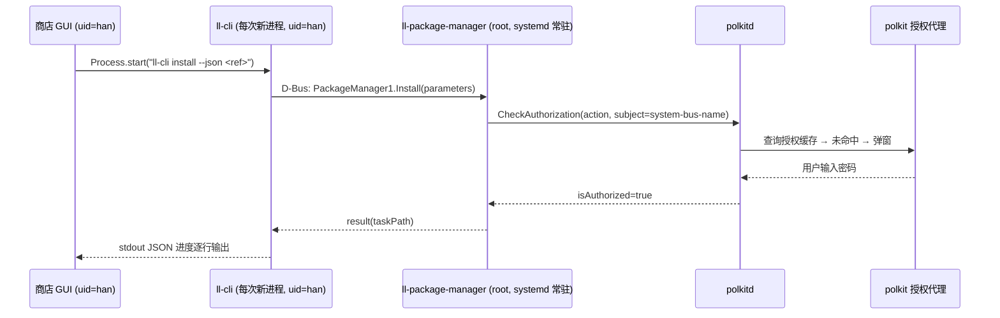

# 47 - 商店安装操作反复弹出 pkexec 授权问题分析报告

> 状态：分析完成
> 日期：2026-09-04
> 环境：Deepin 25 (crimson) / linglong-bin 1.13.8-1（标准 C++ 版）/ linglong-store 3.5.0
> 对照源码：`/home/han/code/linyaps`（master = 1.13.0-110-gd3c642c9）

---

## 1. 问题现象

用户在商店连续点击多个应用的「安装」，**每次点击都会弹出一次 pkexec 密码授权框**，
连续安装 N 个应用就被打断 N 次，体验极差。

初始疑问：是 ll-cli 的问题，还是商店的问题？

## 2. 现状调用链（源码 + 二进制实测核对）

标准 C++ 版 linyaps（1.13.x）的安装链路已经完全 D-Bus 化：

关键事实（均已核实）：

1. **daemon 对每个特权方法入口做 polkit 校验**：
   `libs/linglong/src/linglong/package_manager/package_manager.cpp` 中
   `install/uninstall/update/install-from-file/prune/set-configuration` 等
   6 处调用 `checkPolkitAuthorizationAsync()`。
2. **subject 是调用方的 `system-bus-name`**（`polkit_authority.cpp`）。
   polkit 内部会把 bus name 解析为该连接背后进程的 `(uid, pid, pid 启动时间)` 三元组。
3. **policy 对安装类操作使用 `auth_admin_keep`**
   （`/usr/share/polkit-1/actions/org.deepin.linglong.PackageManager1.policy`，
   `allow_active=auth_admin_keep`）——上游本意是「授权缓存约 5 分钟，避免反复打扰」。
4. **商店每次安装都 spawn 全新的 ll-cli 进程**（`lib/core/platform/cli_executor.dart`
   的 `Process.start`），因此 subject 身份每次都不同。

## 3. 根因结论

**`auth_admin_keep` 的 5 分钟缓存按「调用方进程身份」计算，而 CLI 形态的调用方
每次都是新进程 → 缓存必然未命中 → 每次弹窗。**

- 缓存命中条件：同一个 ll-cli 进程的重复调用（例如终端里交互式 shell 一次
  连装多个包才可能命中）。
- 商店形态：每次点击安装 = 新进程 = 新 subject = 必弹窗。
- 结论：**弹窗行为由上游 `9937c545` 引入 polkit 校验后，「keep 缓存语义」与
  「CLI/GUI 每次新进程调用」的组合方式共同决定，既非商店实现错误，也非本机
  配置问题**。商店侧与上游侧均存在可行改进空间，对比见 §5。

### 3.1 六个 polkit action 清单（来自本机 policy 文件）

| action id | 用途 | 默认（active 会话） |
|-----------|------|---------------------|
| `org.deepin.linglong.PackageManager1.install` | 在线安装 | `auth_admin_keep` |
| `...install-from-file` | 本地文件安装 | `auth_admin_keep` |
| `...update` | 更新 | `auth_admin_keep` |
| `...uninstall` | 卸载 | `auth_admin_keep` |
| `...prune` | 清理缓存 | `auth_admin` |
| `...set-configuration` | 修改 daemon 配置 | `auth_admin` |

## 4. 版本考古：行为是哪次改动引入的

| 时间 | 版本/提交 | 行为 |
|------|-----------|------|
| ≤ 2026-05-20 | `9b782297`（`9937c545~1`）之前 | **root daemon 不做任何授权检查**：安装/卸载从不弹窗（同时存在安全缺陷：任何本地进程可静默驱动 root daemon 装卸软件）。父提交源码中 polkit 相关匹配数为 0，已核实 |
| 2026-05-15 | **`9937c545` "refactor: add polkit authorization to PM"**（作者 reddevillg） | 新增 `polkit_authority.cpp`（137 行）+ `package_manager.cpp` 重构（+362 行），6 个特权方法全部加 `CheckAuthorization`；同期 `cli.cpp` 删除约 199 行旧授权逻辑 |
| 2026-06-18 | `1.13.0` | 该提交随正式版发布（`git tag --contains` 已核实），**所有 1.13.x / 1.14.x 均含此行为** |
| 更早（1.13.0 开发期，见 `docs/23`） | ll-cli `execvp(pkexec)` 自提权模式 | `pkexec.exec` 为 `auth_admin`（无 keep），同样每次弹窗 |
| 2026-08（Deepin 25 官方源短暂提供的 Rust 移植版 `1.14.0~rust1-4`） | 同构架构 + 相同 policy | 行为一致，**非根因**（已卸载并回装标准 C++ 版 1.13.8-1） |

结论：用户「以前不会这样」的记忆准确——`9937c545` 之前确实不弹窗。

## 5. 候选方案对比

### 方案 B：polkit rules.d 免密规则

- 做法：写 `/etc/polkit-1/rules.d/60-linglong-store.rules`，对
  `install/update/install-from-file` 三个 action 在 local+active 会话返回
  `polkit.Result.yes`；设置页加开关（默认关、开启时风险文案确认）。
- 已核实边界：**规则按「调用方身份属性」（uid/会话）匹配，无法收窄到商店**——
  生效后终端 `ll-cli install` 同样免密，任何本机活动会话程序（含恶意程序）
  均可静默安装软件，属系统级全局授权降级。
- 特点：止痛立竿见影、实现成本最低；代价是系统级授权降级，安全边界无法
  收窄到单一前端。未采纳。

### 方案 C：推动上游修复（建议并行）

- 建议上游（引用 `9937c545`）二选一：
  1. `checkPolkitAuthorizationAsync` 的 subject 从「调用方进程」改为调用方
     所在的 `unix-session`，使 keep 缓存按会话命中；
  2. daemon 自行按 `(uid, session)` 缓存「近期已授权」状态。
- 优点：所有 GUI 前端受益、语义最正；缺点：周期不可控。
- 本报告附 issue 要点，见 §7。

### 方案 D：商店自持有 root helper 进程

- 做法：首次安装时 `pkexec <商店二进制> --privileged-helper` 拉起 root 子进程
  （同二进制双人格，入口参数分流），通过 `$XDG_RUNTIME_DIR` 下 0700 Unix socket
  下发 install/update 任务，ll-cli 由 helper 以 root spawn，`--json` 输出经
  socket 原样透传，GUI 退出/空闲超时即自杀。
- 优点：进度零映射（`ll-cli --json` 原样透传）、取消免弹窗（root 发 SIGTERM）、
  授权范围限定商店身份（优于方案 B）。
- 缺点：自研 IPC 协议 + 进程生命周期（EOF 自杀/超时/残留清理/双连接拒绝）+
  自研安全面（命令白名单/锁屏校验），代码量最大且安全责任全在自己；
  与「越简单越可控」的项目原则冲突。
- 特点：授权范围限定商店身份（优于方案 B 的全局降级）、进度零映射；
  代价是自研 IPC 协议与进程生命周期代码量最大、安全责任全部自担。
  未采纳。

### 方案 A：商店直连 D-Bus，不再 spawn ll-cli 做写操作

- 做法：安装/更新类写操作直接调用系统 D-Bus
  `org.deepin.linglong.PackageManager1`；查询类命令（list/info/search/repo）
  维持现有 ll-cli 路径不变。
- 授权语义：daemon 校验 subject = **商店 GUI 进程**（长驻），`auth_admin_keep`
  缓存正常命中 → **约 5 分钟窗口内连续安装/更新/卸载只弹 1 次密码框**。
- 安全语义：无任何自研特权代码；恶意程序冒充不了商店进程的授权缓存，
  锁屏/非活动语义仍由 polkit 裁决。
- 附带收益：取消安装改调 `Task1.Cancel()`，`docs/23` 的「pkexec kill 弹窗
  取消」遗留问题自然消失。

#### 5.1 D-Bus 接口查证（已核对 linyaps 源码与 XML 定义）

| 事项 | 查证结果 | 影响与对策 |
|------|----------|-----------|
| 进度信息 | `Task1.TaskEvent(event, data:a{sv})` 推送 `state` 事件，字段 `{progress, message, state}`（`package_task.cpp:83-88`）；另有 `message` 事件透传日志 | 与 `ll-cli --json` 信息量等价，现有进度 UI 可无损支撑 |
| 任务生命周期 | `Install(parameters:a{sv})` 返回 result → 取 taskPath → **必须再调 `task.Start()`** 才开始执行；结束有 `TaskFinished(result:a{sv})` | repository 需实现「创建→Start→订阅→收尾」编排 |
| 非交互应答 | daemon 可能发 `RequestInteraction(interactionId, messageID, additional)`，需 `ReplyInteraction` 应答；CLI 模式用 `-y` 跳过 | 需在 parameters 中寻找等价非交互键，或实现自动应答 `confirm=true`；若采纳本方案，此为前置验证项 |
| 接口形态 | `Install/Update/Uninstall` 参数与返回均为弱类型 `a{sv}` 字典（无 schema） | 按 linyaps 源码逐字段映射（`api/dbus/*.xml` + `package_manager.cpp`），封装收敛在 Data 层 |
| 取消 | `Task1.Cancel()`（root daemon 收到后 `g_cancellable_cancel()`） | 取代 `pkexec kill -15 <pid>`，零弹窗 |

#### 5.2 综合对比

| 维度 | B rules 免密 | C 上游修复 | D root helper | A 直连 D-Bus |
|------|-------------|-----------|---------------|--------------------------|
| 弹窗频率 | 0 次 | 每会话 1 次 | 首次 1 次 | **5 分钟窗口 1 次** |
| 恶意程序可蹭授权 | ⚠️ 可 | ✅ 不可 | ✅ 不可 | ✅ 不可 |
| 自研特权/安全代码 | 极少 | 无 | ⚠️ 大量 | **无** |
| 进度整合成本 | 无关 | 无关 | 最低（透传） | 低（字段等价） |
| 改动面 | 设置页+文件读写 | 无（上游） | helper 五件套+路由 | D-Bus repository+状态映射 |
| 长期维护 | 差（系统降权遗留） | 好 | 中（自研 IPC 演进） | 好（跟随上游标准接口） |
| 是否依赖上游 | 否 | 是 | 否 | 否 |

## 6. 各方案实施要点

### 6.1 方案 B 如采纳

- 设置页新增开关（默认关闭，开启时风险文案确认）；规则文件内容、写入/移除
  通过 `pkexec bash <临时脚本>` 完成；开关状态以规则文件存在性为唯一事实来源。
- 需评估项：规则覆盖的 action 范围（是否含 uninstall/prune/set-configuration）、
  文案措辞、用户取消 pkexec 授权时的状态回弹。

### 6.2 方案 C 如采纳

- 按 §7.1 要点向 linyaps 提交 issue / PR；期间商店无代码改动。

### 6.3 方案 D 如采纳

- 新增 `lib/core/platform/privileged_helper/`（协议/Server/TaskRunner/Client/
  helper 入口五件套）；`main()` 入口参数分流，helper 模式不初始化 GUI；
  `cli_executor.dart` 写操作路由改造，查询命令维持不变。
- 需评估项：命令白名单范围、锁屏会话加固（`loginctl` 校验）、空闲超时时长、
  pkexec 授权取消（退出码 126）时的失败语义。

### 6.4 方案 A 如采纳

- 新增 Data 层 D-Bus repository（`dbus` Dart 包），安装/更新写操作路由 D-Bus，
  查询命令维持 CLI；进度事件映射到现有 `ProgressEvent` 模型。
- 需评估项：`a{sv}` 字段逐项映射、`task.Start()` 编排时序、
  `RequestInteraction` 应答方式、D-Bus 失败时是否回退 ll-cli 路径及回退条件。

## 7. 附录

### 7.1 上游 issue 要点（对应方案 C，如需推动上游修复）

- 标题建议：`auth_admin_keep never caches for CLI/GUI callers because subject is per-process`
- 事实：`9937c545` 起 daemon 按调用方 `system-bus-name`（解析为
  uid+pid+start-time）做 `CheckAuthorization`；policy 为 `auth_admin_keep`；
  但 CLI/GUI 每次操作 spawn 新进程，keep 缓存永不命中。
- 建议：subject 改用 `unix-session` 或 daemon 侧按 (uid, session) 缓存授权。
- 复现：1.13.x 图形商店连续安装 2 个应用，两次均弹密码框。

### 7.2 关键源码位置索引

| 位置 | 说明 |
|------|------|
| linyaps `9937c545`（2026-05-15） | 引入 daemon polkit 校验的提交（根因） |
| linyaps `libs/linglong/src/linglong/package_manager/polkit_authority.cpp` | subject=`system-bus-name` 的 CheckAuthorization 实现 |
| linyaps `libs/linglong/src/linglong/package_manager/package_manager.cpp` | 6 处特权方法的校验调用点 |
| linyaps `libs/linglong/src/linglong/package_manager/package_task.cpp:83-88` | `TaskEvent(state){progress,message,state}` 事件字段 |
| linyaps `api/dbus/org.deepin.linglong.PackageManager1.xml` / `...Task1.xml` | 弱类型 `a{sv}` 接口定义、`Start/Cancel/ReplyInteraction` |
| 本机 `/usr/share/polkit-1/actions/org.deepin.linglong.PackageManager1.policy` | 六个 action 与 `auth_admin_keep` 默认值 |
| 商店 `lib/core/platform/cli_executor.dart` | 现有 ll-cli spawn/流式解析/取消实现（对照与回退路径） |
| 商店 `docs/23-install-cancel-sigterm-plan.md` | 旧取消方案及其 `pkexec` 弹窗遗留（方案 A/D 下可消除） |

### 7.3 环境操作记录（本次排查过程中的系统变更）

- 卸载 Rust 移植版：`linglong-bin/box/builder 1.14.0~rust1-4` 及
  `linglong-installer 1.6.0-1`（连带移除 `deepin-desktop-environment-*` 元包）；
- 回装标准 C++ 版：`linglong-bin/box 1.13.8-1 / 2.2.1-1`、`linglong-builder 1.13.8-1`、
  `linglong-installer 1.6.0-1`，并恢复三个 `deepin-desktop-environment-*` 元包；
- 恢复后验证：已安装应用列表完好、`ll-cli repo show` 正常、
  `org.deepin.linglong.PackageManager.service` active。
