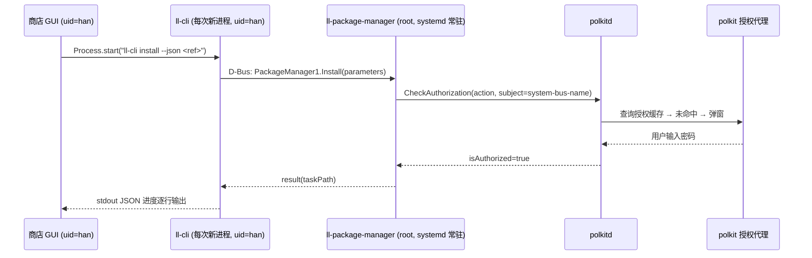

# 47 - 商店安装操作反复弹出 pkexec 授权问题分析报告

> 状态：分析完成
> 日期：2026-09-04
> 环境：Deepin 25 (crimson) / linglong-bin 1.13.8-1（标准 C++ 版）/ linglong-store 3.5.0
> 对照源码：`/home/han/code/linyaps`（master = 1.13.0-110-gd3c642c9）

---

## 1. 问题现象

用户在商店连续点击多个应用的「安装」，**每次点击都会弹出一次 pkexec 密码授权框**，
连续安装 N 个应用就被打断 N 次，体验极差。

初始疑问：是 ll-cli 的问题，还是商店的问题？

## 2. 现状调用链（源码 + 二进制实测核对）

标准 C++ 版 linyaps（1.13.x）的安装链路已经完全 D-Bus 化：

关键事实（均已核实）：

1. **daemon 对每个特权方法入口做 polkit 校验**：
   `libs/linglong/src/linglong/package_manager/package_manager.cpp` 中
   `install/uninstall/update/install-from-file/prune/set-configuration` 等
   6 处调用 `checkPolkitAuthorizationAsync()`。
2. **subject 是调用方的 `system-bus-name`**（`polkit_authority.cpp`）。
   polkit 内部会把 bus name 解析为该连接背后进程的 `(uid, pid, pid 启动时间)` 三元组。
3. **policy 对安装类操作使用 `auth_admin_keep`**
   （`/usr/share/polkit-1/actions/org.deepin.linglong.PackageManager1.policy`，
   `allow_active=auth_admin_keep`）——上游本意是「授权缓存约 5 分钟，避免反复打扰」。
4. **商店每次安装都 spawn 全新的 ll-cli 进程**（`lib/core/platform/cli_executor.dart`
   的 `Process.start`），因此 subject 身份每次都不同。

## 3. 根因结论

**`auth_admin_keep` 的 5 分钟缓存按「调用方进程身份」计算，而 CLI 形态的调用方
每次都是新进程 → 缓存必然未命中 → 每次弹窗。**

- 缓存命中条件：同一个 ll-cli 进程的重复调用（例如终端里交互式 shell 一次
  连装多个包才可能命中）。
- 商店形态：每次点击安装 = 新进程 = 新 subject = 必弹窗。
- 结论：**弹窗行为由上游 `9937c545` 引入 polkit 校验后，「keep 缓存语义」与
  「CLI/GUI 每次新进程调用」的组合方式共同决定，既非商店实现错误，也非本机
  配置问题**。

### 3.1 六个 polkit action 清单（来自本机 policy 文件）

| action id | 用途 | 默认（active 会话） |
|-----------|------|---------------------|
| `org.deepin.linglong.PackageManager1.install` | 在线安装 | `auth_admin_keep` |
| `...install-from-file` | 本地文件安装 | `auth_admin_keep` |
| `...update` | 更新 | `auth_admin_keep` |
| `...uninstall` | 卸载 | `auth_admin_keep` |
| `...prune` | 清理缓存 | `auth_admin` |
| `...set-configuration` | 修改 daemon 配置 | `auth_admin` |

## 4. 版本考古：行为是哪次改动引入的

| 时间 | 版本/提交 | 行为 |
|------|-----------|------|
| ≤ 2026-05-20 | `9b782297`（`9937c545~1`）之前 | **root daemon 不做任何授权检查**：安装/卸载从不弹窗（同时存在安全缺陷：任何本地进程可静默驱动 root daemon 装卸软件）。父提交源码中 polkit 相关匹配数为 0，已核实 |
| 2026-05-15 | **`9937c545` "refactor: add polkit authorization to PM"**（作者 reddevillg） | 新增 `polkit_authority.cpp`（137 行）+ `package_manager.cpp` 重构（+362 行），6 个特权方法全部加 `CheckAuthorization`；同期 `cli.cpp` 删除约 199 行旧授权逻辑 |
| 2026-06-18 | `1.13.0` | 该提交随正式版发布（`git tag --contains` 已核实），**所有 1.13.x / 1.14.x 均含此行为** |
| 更早（1.13.0 开发期，见 `docs/23`） | ll-cli `execvp(pkexec)` 自提权模式 | `pkexec.exec` 为 `auth_admin`（无 keep），同样每次弹窗 |
| 2026-08（Deepin 25 官方源短暂提供的 Rust 移植版 `1.14.0~rust1-4`） | 同构架构 + 相同 policy | 行为一致，**非根因**（已卸载并回装标准 C++ 版 1.13.8-1） |

结论：用户「以前不会这样」的记忆准确——`9937c545` 之前确实不弹窗。

## 5. 附录

| 位置 | 说明 |
|------|------|
| linyaps `9937c545`（2026-05-15） | 引入 daemon polkit 校验的提交（根因） |
| linyaps `libs/linglong/src/linglong/package_manager/polkit_authority.cpp` | subject=`system-bus-name` 的 CheckAuthorization 实现 |
| linyaps `libs/linglong/src/linglong/package_manager/package_manager.cpp` | 6 处特权方法的校验调用点 |
| linyaps `libs/linglong/src/linglong/package_manager/package_task.cpp:83-88` | `TaskEvent(state){progress,message,state}` 事件字段 |
| linyaps `api/dbus/org.deepin.linglong.PackageManager1.xml` / `...Task1.xml` | 弱类型 `a{sv}` 接口定义、`Start/Cancel/ReplyInteraction` |
| 本机 `/usr/share/polkit-1/actions/org.deepin.linglong.PackageManager1.policy` | 六个 action 与 `auth_admin_keep` 默认值 |
| 商店 `lib/core/platform/cli_executor.dart` | 现有 ll-cli spawn/流式解析/取消实现（对照与回退路径） |
| 商店 `docs/23-install-cancel-sigterm-plan.md` | 旧取消方案及其 `pkexec` 弹窗遗留问题记录 |

### 5.2 环境操作记录（本次排查过程中的系统变更）

- 卸载 Rust 移植版：`linglong-bin/box/builder 1.14.0~rust1-4` 及
  `linglong-installer 1.6.0-1`（连带移除 `deepin-desktop-environment-*` 元包）；
- 回装标准 C++ 版：`linglong-bin/box 1.13.8-1 / 2.2.1-1`、`linglong-builder 1.13.8-1`、
  `linglong-installer 1.6.0-1`，并恢复三个 `deepin-desktop-environment-*` 元包；
- 恢复后验证：已安装应用列表完好、`ll-cli repo show` 正常、
  `org.deepin.linglong.PackageManager.service` active。
