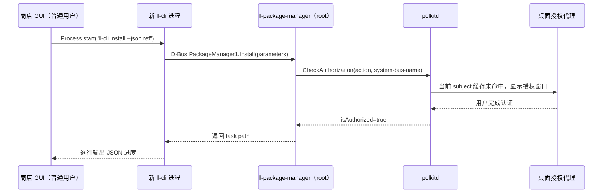
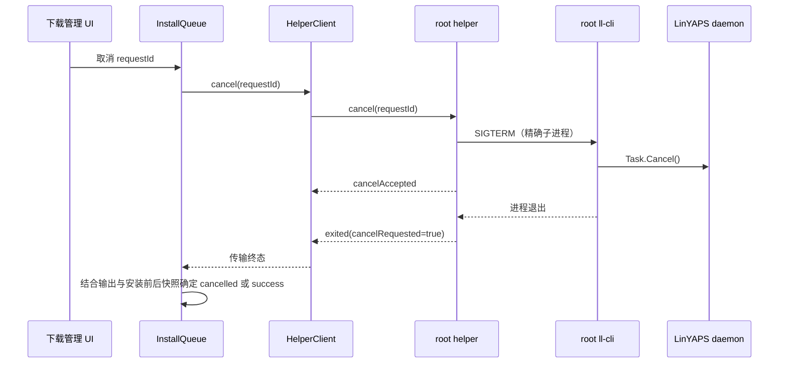

# 47 - 商店安装操作反复弹出 pkexec 授权问题分析与修复设计

> 状态：方案草案 v2 已收敛（直启为主、仅 FUSE 暂存），待人工复核后实现
>
> 日期：2026-09-04
>
> v2 修订（2026-09-04）：收缩“全形态统一暂存”为仅 FUSE 文件系统暂存；简化 helper
> 启动自检；将“跨形态字节级一致”验收放宽为“行为语义一致”
>
> 环境：Deepin 25 (crimson) / linglong-bin 1.13.8-1（标准 C++ 版）/
> linglong-store 3.5.0
>
> 对照源码：`/home/han/code/linyaps`
> （master = `1.13.0-110-gd3c642c9`）

---

## 1. 文档目的

本文件只解决以下一个问题：

> 用户连续安装或更新多个应用时，每个任务都会再次弹出管理员授权窗口；取消正在
> 执行的任务还会因为 `pkexec kill` 再弹一次授权窗口。

最终方案是在商店需要执行首个安装类任务时，通过 `pkexec` 启动一个独立、最小、
按需存活的 root helper。helper 在同一次短期会话中串行启动系统
`/usr/bin/ll-cli`，使后续安装、更新和取消复用第一次授权，不再为每个任务重复弹窗。

本方案不把商店 GUI 进程提升为 root，不解析或直接调用 LinYAPS 私有 D-Bus 消息体，
也不把 helper 扩展成通用特权命令服务。

## 2. 问题现象与根因

### 2.1 现状调用链

标准 C++ 版 LinYAPS 1.13.x 的安装链路已经 D-Bus 化：



已经核实的事实：

1. daemon 在 `install`、`update`、`uninstall`、`install-from-file`、`prune`、
   `set-configuration` 等特权入口分别调用 Polkit。
2. LinYAPS 使用调用者的 `system-bus-name` 作为 Polkit subject。
3. 安装、更新等 action 的 active policy 为 `auth_admin_keep`。
4. 商店当前每个任务都会 `Process.start` 一个全新的 `ll-cli`。
5. 新 `ll-cli` 拥有新的 D-Bus unique name 和进程身份，因此前一个进程的临时授权
   不能稳定复用，连续 N 个任务会出现 N 次授权。
6. 当前取消逻辑需要再执行一次 `pkexec kill -15 <PID>`，所以取消还会额外弹窗。

### 2.2 根因结论

问题不是密码缓存损坏，也不是本机异常，而是以下三者组合后的必然结果：

```text
Polkit 临时授权绑定调用 subject
        +
每个商店任务创建全新 ll-cli 进程
        +
取消 root ll-cli 需要再次通过 pkexec 发信号
        =
安装、更新和取消反复打断用户
```

### 2.3 上游能力边界

当前上游 `ll-cli` 没有 `--session`、批处理 RPC 或常驻服务模式。所谓
“让商店连接一个由上游维护的 ll-cli session”是需要 LinYAPS 新增的能力，不是现有
接口，不能作为本次可落地方案。

LinYAPS 开发人员同时明确指出 D-Bus 消息体可能继续变化。商店若直接维护
`PackageManager1`/`Task1` 的弱类型 `a{sv}` 编解码，就会把上游内部协议的变化成本
转移到商店。因此本方案只依赖系统安装的 `ll-cli` 命令语义，D-Bus 适配仍由同版本的
LinYAPS CLI 负责。

### 2.4 行为变化来源

| 时间/版本 | 行为 |
|---|---|
| `9937c545` 之前 | root daemon 未在这些方法入口执行 Polkit 校验，安装不弹窗，但任何本地进程也可能静默驱动 daemon，存在安全缺口 |
| `9937c545`（2026-05-15） | 上游为六个特权方法加入 Polkit 校验，并使用调用方 system bus 身份作为 subject |
| LinYAPS 1.13.0 起 | 正式版本包含上述校验；商店“每个任务一个新 CLI”的运行方式开始稳定触发重复授权 |
| Deepin 提供过的 Rust 移植版 | policy 与调用结构相同，不是重复弹窗的根因 |

因此不能通过回退旧 daemon 行为解决问题，也不能加入全局免密规则恢复旧体验；本方案
只在商店自身的短期任务会话中复用一次明确授权。

## 3. 目标与非目标

### 3.1 必须实现的目标

1. 第一个安装或更新任务最多弹出一次 `pkexec` 授权窗口。
2. helper 存活期间，后续安装和更新不再重复授权。
3. 取消 helper 创建的当前任务不再弹出第二个授权窗口。
4. 保持现有“同一时刻只运行一个安装类任务”的串行队列约束。
5. 保留现有 `CliOutputParser` 的 ll-cli 输出解析和安装结果复验逻辑。
6. GUI、网络、缓存、图片解析和 Widget 树始终以普通用户运行。
7. 用户拒绝首次授权后不回退旧路径，也不自动尝试下一个任务造成弹窗风暴。
8. helper 只在需要时启动，并在 GUI 退出或空闲超时后释放 root 权限。

### 3.2 本次明确不做

- 不修改 LinYAPS 上游代码。
- 不直接调用 LinYAPS D-Bus 安装接口。
- 不设计或等待不存在的 `ll-cli --session`。
- 不让 Flutter 主进程以 root 运行。
- 不新增 systemd 常驻服务、系统 D-Bus 服务或公共 Unix Socket。
- 不使用 `sudo`、`sudo -A`、sudoers 时间戳或免密 sudoers 配置。
- 不安装允许无条件放行的 Polkit rules。
- 不把 helper 用于卸载、清理、修改仓库配置、修复环境或启动应用。
- 不在本次加入 `.layer`/`.uab` 本地文件安装。
- 不按 DEB、RPM、AppImage、解压 bundle 或开发构建拆分业务行为或协议；唯一例外是
  “bundle 位于 FUSE 文件系统时先暂存再启动”，该分支只影响启动路径，不影响业务语义。
- 不为任何安装形态维护第二套协议、任务状态机或降级授权流程。
- 不重写安装队列、进度状态机或下载管理 UI。

## 4. 架构决策

### 4.1 方案对比

| 方案 | 决策 | 原因 |
|---|---|---|
| 商店直接维护 LinYAPS D-Bus | 拒绝 | 消息体会变化，商店需长期跟随上游内部协议 |
| 上游 `ll-cli --session` | 不采用 | 当前不存在，落地时间不可控 |
| 整个 Flutter 商店以 root 运行 | 拒绝 | GUI、网络和第三方依赖攻击面过大，并会污染用户目录权限 |
| 同一个 Flutter ELF 增加 Dart helper 模式 | 拒绝 | Dart `main()` 前 Linux runner 已创建 GTK/Flutter 宿主；root 仍会加载 Flutter 和插件动态库 |
| 在原生 `main.cc` 中分流同一个 ELF | 拒绝 | 虽可不创建窗口，但动态加载器仍会加载该 ELF 链接的 Flutter 和插件库 |
| 独立最小 C++ helper，按需由 pkexec 启动 | **采用** | 特权面最小，可继续调用稳定 CLI，取消不再需要第二次 pkexec |

### 4.2 为什么独立 helper 不会显著增加打包复杂度

helper 作为新的 CMake target 安装到 Flutter bundle：

```text
bundle/
├── linglong_store
├── libexec/
│   └── linglong_store_helper
├── lib/
└── data/
```

当前 DEB、RPM、AppImage、AUR 和 Copr 链路都会整体复制 Flutter bundle，因此新增
CMake `install(TARGETS ...)` 后，helper 会随 bundle 进入产物，不需要每种包格式再维护
一份 helper 源码或构建逻辑。

helper target 必须与 Flutter runner 解耦：

- 不链接 `flutter`、GTK、Flutter 插件或项目业务动态库；
- 显式使用空的 install RPATH，不能继承 GUI 的 `$ORIGIN/lib`；
- 不初始化 Flutter Engine、Widget 树、窗口或桌面事件循环；
- 不引入 Rust 工具链；
- 仅实现协议校验、子进程管理和生命周期收尾。

### 4.3 分层边界

```text
Presentation
    ↓ 只发送安装/更新/取消事件
InstallQueue / AppOperationTaskExecutor
    ↓ 仍是唯一队列与业务状态所有者
LinglongCliRepository
    ├── 查询/卸载等非本方案命令 → 现有 CliExecutor
    └── 安装/更新 → PrivilegedHelperClient
                         ↓ 私有 stdin/stdout
                      pkexec
                         ↓
                   root C++ helper
                         ↓ 固定 argv
                   /usr/bin/ll-cli
                         ↓
                   LinYAPS daemon
```

职责限制：

- Presentation 不允许直接执行 `pkexec` 或连接 helper。
- Application 安装队列继续拥有任务顺序、状态、超时和是否继续下一任务的决策权。
- Data Repository 继续把 ll-cli 原始行转换为领域进度，并执行安装前后状态复验。
- `PrivilegedHelperClient` 只负责 helper 会话和传输，不判断安装成功、失败或进度阶段。
- `PrivilegedHelperBinary` 是所有运行形态唯一的 helper 定位入口，并独占 FUSE 形态的
  暂存与清理逻辑；不得在 Repository、开发模式或打包代码中增加第二条启动路径。
- C++ helper 不读取商店数据库、不访问 API、不理解应用名称或 UI 状态。

`PrivilegedHelperClient` 必须是应用生命周期单例，不能放入会被 `autoDispose` 重建的
Repository 实例。并发调用 `ensureStarted()` 必须复用同一个启动 Future，防止快速入队
时同时拉起多个 `pkexec`。

该架构还有一个必须先通过的成立性门禁：在目标 LinYAPS 版本上，由一次 pkexec 启动
的 root helper 再启动多个 root `/usr/bin/ll-cli` 时，后续 ll-cli 不得产生嵌套授权框。
`docs/23` 已证明 pkexec 后的 root ll-cli 可以完成安装，但编码集成前仍需用最小原型在
当前 1.13.8 环境复验“连续两个 root ll-cli 只出现 helper 的一次授权”。若该门禁失败，
必须停止实现并重新评审，不能通过免密 Polkit rule 绕过。

## 5. 支持范围

### 5.1 helper 能力白名单

| 业务操作 | 协议操作 | helper 生成的 ll-cli 语义 | 本次支持 |
|---|---|---|---|
| 在线安装 | `install` | `ll-cli install --json appId[/version] [--force]` | 是 |
| 在线更新 | `update` | `ll-cli upgrade --json appId` | 是 |
| 取消当前安装/更新 | `cancel` | 对 helper 自己创建的当前子进程发送 SIGTERM | 是 |
| helper 正常退出 | `shutdown` | 不执行 ll-cli | 是 |
| 本地文件安装 | 无 | 不接受路径 | 否 |
| 卸载 | 无 | 不生成 `uninstall` | 否 |
| 清理 | 无 | 不生成 `prune` | 否 |
| 修改配置 | 无 | 不生成 `repo`/`set-configuration` | 否 |
| 任意命令 | 无 | 禁止客户端传 executable/argv | 否 |

协议中的 `update` 是商店业务名称，helper 必须映射成当前真实子命令 `upgrade`，不能
直接拼成不存在的 `ll-cli update`。

### 5.2 运行形态与启动方式

| 运行形态 | 是否启用 helper | 启动方式 |
|---|---|---|
| DEB/RPM/AUR/Copr 系统安装 | **是** | 直启 bundle 安装路径（root 属主，包管理器保护） |
| 用户解压的 release bundle | **是** | 直启 bundle 内固定路径 |
| `flutter run`/本地开发构建 | **是** | 直启构建产物内固定路径 |
| AppImage extract-and-run | **是** | 直启提取目录内路径（提取目录位于普通文件系统） |
| AppImage FUSE 挂载运行 | **是** | 先暂存到一次性私有目录再启动（FUSE 拒绝 root 从挂载点执行） |

启动方式的唯一分支依据是 bundle 所在文件系统是否为 FUSE。这是一个物理事实：Linux
FUSE 默认只允许挂载用户访问，root 未必能从 AppImage 挂载点直接 `execve` helper；而
普通文件系统上 root 总是可以执行用户属主的文件，复制没有收益，反而把“包管理器保护
的系统文件”降级成“用户可写目录里的副本”。因此除 FUSE 外的所有形态直接把 bundle 内
固定路径交给 pkexec，不产生暂存文件；同时不调用 `LinuxAppInstallationProbe` 决定是否
启用，不查询 dpkg/RPM 归属，不读取发行版名称，也不根据 `APPIMAGE`、`APPDIR` 或
Debug/Release 模式选择路径。

所有运行形态共享同一用户行为：首次任务授权一次、helper 活跃或空闲未满五分钟时继续
复用、取消不再授权、授权失败后暂停队列。协议、白名单、队列状态、错误映射和 UI 文案
必须完全相同；“直启/暂存”只影响 pkexec 参数中的路径值，不影响任何业务语义，开发时
验证通过的流程就是最终产物运行的流程。

#### 5.2.1 仅 FUSE 形态需要暂存

Type 2 AppImage 通常把 AppDir 作为当前用户拥有的只读 FUSE 挂载。Linux FUSE 默认
限制挂载用户之外的进程访问，root 不一定能从 AppImage 挂载点直接 `execve` helper，
因此该形态必须先把 helper 复制到 root 可执行的位置。其余形态（系统包、解压 bundle、
开发构建、extract-and-run 提取目录）都位于普通文件系统，root 可以直接执行用户属主
文件，无需复制。

启动流程如下：

1. 以 `Platform.resolvedExecutable` 所在 bundle 为唯一基准，从固定相对路径读取
   `libexec/linglong_store_helper`；不得接受环境变量或调用方指定其他 helper 路径；
2. 检测 bundle 所在文件系统类型（解析 `/proc/self/mountinfo` 中挂载点的 fstype，
   `fuse` 或以 `fuse.` 开头即视为 FUSE；或经 `dart:ffi` 调用 `statfs(2)` 判断
   `FUSE_SUPER_MAGIC`，实现二选一，检测结果需可注入以便单测覆盖两个分支）；
3. 非 FUSE：直接把该绝对路径交给 pkexec，流程结束，不产生任何暂存文件；
4. FUSE：在有效 `$XDG_RUNTIME_DIR` 下创建随机、仅当前用户可访问的临时目录
   （`0700`），以“新建且不得覆盖”的方式复制 helper 为 `0500` 文件，再把暂存文件的
   绝对路径交给 pkexec；
5. helper 就绪后自行 `unlink` 暂存文件并移除空父目录；GUI 在 pkexec 启动失败、
   授权取消（退出码 126）和进程退出后执行幂等清理；
6. helper 启动后只使用私有 stdin/stdout，不再读取原 bundle（AppImage 场景下 GUI
   退出后 FUSE 挂载随之消失，helper 收尾不能依赖原路径继续存在）。

检测按“是 FUSE 就暂存”保守处理：即使个别配置（如 `allow_other`）下 root 本可访问，
多一次复制也只是冗余，不影响正确性。暂存的只有不依赖 Flutter、GTK 或项目动态库的
单个小型 helper，不复制 GUI bundle，也不从暂存目录加载动态库。若因 `noexec` 挂载、
root-squash NFS 等罕见文件系统限制导致 pkexec 执行失败，统一按 §10.3 的“授权组件
不可用”失败处理，不为此新增分支。

#### 5.2.2 信任模型按形态区分（已接受）

| 形态 | pkexec 实际执行对象 | 来源保护 |
|---|---|---|
| DEB/RPM/AUR/Copr | 系统安装路径中的 helper（root 属主） | 包管理器保护，无暂存、无 TOCTOU 窗口 |
| 解压 bundle / 开发构建 | bundle 内用户可写文件 | 用户明确授权执行自己 bundle 内的文件，与 pkexec 执行用户自有脚本语义一致 |
| AppImage FUSE | 一次性暂存副本 | 同上；复制仅因 FUSE 拒绝 root 执行，暂存目录属当前用户，同 UID 篡改窗口客观存在 |

共同边界：helper 白名单约束的是“授权之后能做什么”，不能证明 helper 二进制来源可信。
若 bundle 在启动前已被同 UID 恶意进程或用户篡改，GUI 和 helper 可能同时被替换，
helper 内部任何自检都无法自证清白。产品决策在 2026-09-04 明确接受解压、开发构建和
AppImage 形态的这一剩余风险，以换取最小实现；系统包形态不存在此窗口。本次不新增
签名体系、公钥、系统 launcher 或专用 Polkit rule。文档和实现不得把“行为语义一致”
误写成“所有 bundle 来源都可信”。

## 6. IPC 与协议

### 6.1 传输选择

GUI 使用以下方式启动 helper：

```text
pkexec --disable-internal-agent <本次运行解析出的helper绝对路径>
```

这里的绝对路径按 §5.2.1 规则解析：普通文件系统形态为 bundle 内固定路径，FUSE 形态
为一次性暂存路径。启动参数不携带安装类型、Debug/Release 模式、shell、业务命令或
其他可执行文件路径。两种路径统一使用 pkexec 的通用
`org.freedesktop.policykit.exec` 授权，不安装绑定固定路径或特定包格式的自定义
policy/rule。

随后直接复用 `Process.start` 建立的 stdin/stdout：

- GUI → helper：helper stdin，发送控制请求；
- helper → GUI：helper stdout，只发送协议事件；
- helper 自身诊断：stderr，由 GUI 有界收集并写入现有日志；
- ll-cli stdout/stderr：由 helper 单独捕获，封装为协议事件后转发；
- ll-cli stdin：连接 `/dev/null`，不得继承 helper 的控制通道。

不创建 `$XDG_RUNTIME_DIR` Socket。`0700` 只能隔离其他 Unix 用户，不能隔离同一 UID
下的其他应用；命名 Socket 还会引入路径抢占、残留清理、身份校验和旧 helper 接管等
额外问题。父子进程私有标准流足以覆盖本需求。

使用 `--disable-internal-agent` 是为了在桌面 Polkit Agent 不可用时明确失败，避免
`pkexec` 的文本认证代理占用 helper stdin，与业务协议争抢输入。

### 6.2 编码规则

协议采用 NDJSON：UTF-8 编码，一行一个完整 JSON 对象。所有消息都必须包含：

- `v`：协议版本，首版固定为整数 `1`；
- `type`：消息类型；
- 与消息类型对应的固定字段。

约束：

- 单条 GUI 请求最大 16 KiB；超过上限立即拒绝并关闭 helper；
- 单条 ll-cli 输出行最大 1 MiB；超过上限终止当前子进程并报告传输失败；
- helper stdout 禁止输出非协议文本；
- JSON 字符串中的换行必须由编码器转义，不能破坏按行分帧；
- helper 端不得手写通用 JSON 解析器；首版固定使用 vendored、锁定版本的
  `nlohmann/json` 单头文件，不新增系统运行时依赖，第三方源码与许可证必须一并入库；
- `v != 1`、未知 `type`、字段类型错误、重复 requestId 或超长字段一律拒绝；
- 客户端不能发送 executable、argv、环境变量、工作目录、PID 或文件路径。

### 6.3 GUI 请求矩阵

| `type` | 必需字段 | 可选字段 | 语义 |
|---|---|---|---|
| `start` + `operation=install` | `requestId`、`appId`、`force` | `version` | 启动一个在线安装 |
| `start` + `operation=update` | `requestId`、`appId` | 无 | 更新指定应用 |
| `cancel` | `requestId` | 无 | 取消同 ID 的当前任务 |
| `shutdown` | 无 | 无 | helper 空闲时正常退出 |

示例：

```json
{"v":1,"type":"start","requestId":"task-123","operation":"install","appId":"org.deepin.demo","version":"1.2.3","force":false}
{"v":1,"type":"start","requestId":"task-124","operation":"update","appId":"org.deepin.demo"}
{"v":1,"type":"cancel","requestId":"task-124"}
{"v":1,"type":"shutdown"}
```

字段校验最低要求：

- `requestId`：1～128 字节，只允许 ASCII 字母、数字、`.`、`_`、`-`；
- `appId`：1～255 字节，只允许 ASCII 字母、数字、`.`、`_`、`-`，不能包含 `/`、
  `:`、空白和控制字符；
- `version`：1～128 字节，只允许 ASCII 字母、数字、`.`、`_`、`+`、`~`、`-`；
- `force`：只能是 JSON boolean；
- update 请求不得携带 `version` 或 `force`；
- install 请求不得携带 channel、arch、module、repo 或本地路径。

这些检查是能力边界，不替代 ll-cli 自身的业务校验。即使字段完全合法，helper 仍只用
`execve`/等价无 Shell API 构造独立 argv，绝不能通过字符串拼接调用 `sh -c`。

### 6.4 helper 事件矩阵

| `type` | 关键字段 | 语义 |
|---|---|---|
| `ready` | `v` | helper 已完成 root 身份、暂存文件和协议初始化检查 |
| `started` | `requestId`、`operation` | ll-cli 子进程已经创建 |
| `output` | `requestId`、`stream`、`line` | 一行原始 ll-cli stdout/stderr |
| `cancelAccepted` | `requestId` | SIGTERM 已发送或任务正处于退出过程 |
| `exited` | `requestId`、`exitCode`、`cancelRequested` | 子进程已真实退出 |
| `error` | `requestId?`、`code`、`message`、`fatal` | 请求、启动、协议或 helper 运行错误 |

`started` 中可以携带 `pid` 作为诊断字段，但 GUI 不得保存它作为取消凭据。取消只发送
`requestId`，helper 只允许操作自己创建且仍登记为 current 的子进程。

第一版 `error.code` 只需要以下稳定值：

| code | 含义 | helper 是否继续可用 |
|---|---|---|
| `invalidRequest` | JSON、字段或白名单校验失败 | 否，关闭通道 |
| `protocolMismatch` | 协议版本不兼容 | 否 |
| `busy` | 已有 current task，拒绝第二个 start | 是 |
| `notRunning` | cancel 的 requestId 不是当前任务 | 是 |
| `spawnFailed` | 无法启动固定 `/usr/bin/ll-cli` | 是 |
| `outputTooLarge` | 子进程单行输出超过上限 | 否，终止任务后退出 |
| `internal` | 无法安全恢复的 helper 错误 | 否 |

helper 不解析 ll-cli 的进度、成功或失败文案。GUI 取出 `output.line` 后继续交给现有
`CliOutputParser`，以免 helper 与 LinYAPS JSON 消息体耦合。

## 7. 命令构造与运行环境

helper 只允许执行固定绝对路径：

```text
/usr/bin/ll-cli
```

允许的 argv 模板只有：

```text
["/usr/bin/ll-cli", "install", "--json", appIdOrAppIdVersion]
["/usr/bin/ll-cli", "install", "--json", appIdOrAppIdVersion, "--force"]
["/usr/bin/ll-cli", "upgrade", "--json", appId]
```

helper 必须自己根据类型化请求创建 argv，客户端不得提供或覆盖任何元素。

子进程环境必须从空白白名单构造，只设置运行 ll-cli 所需的固定安全值：
`LC_ALL=C.UTF-8`、`LANG=C.UTF-8`、`PATH=/usr/sbin:/usr/bin:/sbin:/bin`，以及从
`getpwuid(0)` 获得的 root `HOME`、`USER`、`LOGNAME`。不得透传 GUI 的 `LD_*`、
`PYTHON*`、`QT_*`、`HOME`、`PATH` 或其他任意环境变量。工作目录固定为 `/`，不继承
用户当前目录。

helper 启动时检查：

1. `geteuid() == 0`；
2. `PKEXEC_UID` 存在、为合法普通用户 UID（同时排除 root 绕过 pkexec 手工直跑的
   场景，此时该变量不存在）；
3. `/usr/bin/ll-cli` 是普通文件，不允许 group/other 写入；
4. stdin/stdout 是有效的父子控制通道。

检查通过后，FUSE 暂存形态的 helper 立即 `unlink` 暂存文件并移除空父目录。该清理
属于运行时卫生，防止运行时目录积累残留副本；它不是来源证明——同 UID 进程本来就能
创建完全相同的文件，真正的边界是每次 pkexec 启动都需要用户重新授权。任一检查失败
都应在建立业务会话前退出，不能降级执行其他命令。

明确不做的检查：不校验父进程 UID，不取证自身 exe 路径的属主、权限或路径节点符号
链接。这类检查只能证明“文件由本 UID 按规范暂存”，而 §5.2.2 承认的威胁（同 UID
恶意进程、被篡改 bundle）恰好满足该条件，检查结果恒真，不改变任何攻击者的能力
边界，只增加代码和测试负担。

## 8. 串行、取消与结果判定

### 8.1 串行约束

helper 内只有 `idle` 和 `running(requestId)` 两种任务状态：

- `idle` 接受一个合法 start 并进入 running；
- `running` 收到第二个 start 返回 `busy`；
- 只有当前子进程被 `waitpid` 回收并发送 `exited` 后才回到 idle；
- cancel、shutdown 和 EOF 与进程退出的竞态必须在同一个事件循环中串行处理。

helper 的 busy 检查是最后一道防线，不替代 Application 层安装队列。正常运行时队列
本身就不会发送并发 start。

### 8.2 取消流程



正常取消只能发送 SIGTERM，因为 LinYAPS 的 SIGTERM handler 会调用 D-Bus
`Task.Cancel()`，这是已经在 `docs/23-install-cancel-sigterm-plan.md` 真机验证过的协作取消
路径。helper 永远不能 kill `ll-package-manager` daemon。

`cancelAccepted` 只代表信号已经发出，不代表 daemon 一定取消成功。任务可能在取消到达
前完成，因此最终状态仍由 Repository 已有的输出解析和安装前后快照复验决定：

- 已收到明确成功或目标版本已经落地：最终为 success；
- 已请求取消、子进程退出且目标未落地：最终为 cancelled；
- 子进程异常消失且结果无法确认：最终为 interrupted/failed，不得伪装成 cancelled。

关闭 helper 时，SIGTERM 后给予子进程最多 5 秒协作退出；仍未退出才允许 SIGKILL
回收本地子进程。该兜底不能标记为“取消成功”，因为 daemon 可能继续后台任务，必须
记录为结果不确定并触发已安装状态复验。

## 9. helper 生命周期

### 9.1 启动与复用

1. 浏览商店、查询列表和加入空队列时不启动 helper。
2. 队列准备执行第一个 install/update 时调用 `ensureStarted()`。
3. client 按 §5.2.1 定位 helper：普通文件系统形态直接以 bundle 内绝对路径启动一次
   `pkexec --disable-internal-agent helper`，FUSE 形态先创建一次性暂存副本再启动；
   两种启动方式对队列完全透明。
4. 只有收到 `ready(v=1)` 后才能发送 start。
5. 同一 GUI 会话后续任务复用现有进程，不再调用 pkexec。
6. helper 运行期间仍然一次只启动一个 ll-cli。

启动必须有短超时；pkexec 已退出、helper 未发送 ready、协议版本不匹配或通道提前 EOF
都视为启动失败，不能假定 helper 可用。

### 9.2 空闲退出

“空闲五分钟”定义为：

- 当前没有 ll-cli 子进程；
- 自上一个任务发送 `exited` 起五分钟没有接受新的 start。

任务实际下载或安装的时间不计入空闲时间。新 start 会取消空闲计时；下一次任务结束后
重新从零计时。空闲超时后 helper 正常关闭 stdout 并退出，GUI 只清理 client 引用，
不主动重新启动。用户以后再次安装时才重新授权。

### 9.3 父子死亡兜底

helper 必须覆盖以下退出路径：

| 触发 | 行为 |
|---|---|
| GUI 正常关闭 stdin | 协作取消 current，回收子进程，helper 退出 |
| GUI 崩溃/被杀 | `PR_SET_PDEATHSIG` 触发 helper SIGTERM，执行相同清理 |
| helper 收到 SIGTERM/SIGINT | 停止接收请求，协作取消 current 后退出 |
| helper 空闲五分钟 | 正常退出 |
| helper 崩溃/SIGKILL/OOM | ll-cli 子进程自己的 parent-death signal 触发 SIGTERM |

不能把 `finally`、析构函数或 signal handler 当成 SIGKILL/崩溃场景的唯一保证。helper
和其创建的 ll-cli 都要在原生进程层设置父死亡信号，并在设置后再次检查父 PID，封住
“父进程先退出、子进程后设置 prctl”的竞态。

helper 与 ll-cli 的关系只在本进程树内维护，不扫描、不 killall、不接管其他终端或
其他应用创建的 ll-cli。

helper 经 pkexec `execve` 后只依赖自身内存映像和私有 stdio，不再读取原 bundle。
AppImage FUSE 场景下 GUI 退出会连带消失挂载点，因此 helper 的协作取消与子进程回收
不能依赖原路径存在；直启形态没有该约束，但同样不需要回读 bundle。

## 10. 授权失败与用户体验定义

### 10.1 正常体验

| 场景 | 用户可见行为 |
|---|---|
| 本次 GUI 会话首次执行 install/update | 显示一次桌面 Polkit 授权窗口 |
| helper 存活期间继续安装或更新 | 不再显示授权窗口，任务按队列串行执行 |
| 取消当前任务 | 立即进入取消中，不再显示第二个授权窗口 |
| 队列执行超过五分钟 | helper 因任务仍活跃继续存活，不会中途重新授权 |
| 队列空闲不足五分钟后再安装 | 复用 helper，不弹窗 |
| 队列空闲超过五分钟后再安装 | helper 已退出，重新显示一次授权窗口 |
| 关闭商店 | 当前任务协作取消，helper 随商店退出 |

### 10.2 用户取消首次授权

`pkexec` 退出码 126 表示用户关闭了认证对话框。此时必须：

1. 当前任务以稳定的 `authorizationCancelled` 失败事实结束；
2. 显示一次“安装需要管理员授权”的本地化提示；
3. 保留其余 pending 任务，但停止自动启动下一任务；
4. 不回退当前普通用户 ll-cli 路径；
5. 不自动再次拉起 pkexec；
6. 用户下一次明确点击安装或重试时，解除本次运行时暂停并再次尝试授权。

这个“暂停”只需要是 `InstallQueue` controller 的运行时门闩，不新增持久化 schema，
不设计完整暂停/恢复状态机。应用重启后仍按现有队列恢复规则处理。

`pkexec` 退出 127、helper ready 超时、helper 异常退出或协议错误同样不得自动启动下一个
任务；它们使用各自的可诊断失败类型和提示，只有用户明确重试才重新授权，避免故障时
连续弹窗。

### 10.3 所有运行形态体验一致

DEB、RPM、AUR、Copr、AppImage、用户解压 release bundle 和 `flutter run`/本地开发
构建必须具备完全相同的功能和交互语义：

- 首个 install/update 只出现一次桌面授权；
- helper 存活期间连续任务不再次授权；
- 取消当前任务不出现授权窗口；
- 空闲五分钟、关闭商店、授权取消和故障后的行为全部遵循 §9、§10.1 和 §10.2；
- UI、翻译和发布说明不得把任何运行形态标记成“兼容模式”“功能受限”或“每次需授权”。

“一致”的验收标准是授权次数、触发时机、队列行为、取消行为、错误文案和五分钟生命
周期，不要求 pkexec 参数中的路径在不同形态间字面相同。Polkit 对话框会如实显示本次
以 root 执行的 helper 绝对路径（系统形态为安装路径，FUSE 形态为暂存路径），该差异
是 polkit 透明性的正常表现；不允许通过伪造程序名、隐藏安全信息或放宽 policy 改善
观感。

若 FUSE 检测、暂存或 pkexec 启动失败（包括 `noexec` 挂载、root-squash NFS 等罕见
文件系统限制），所有运行形态都显示相同的“授权组件不可用”错误并停止自动消费队列；
严禁悄悄回退到“每个任务直接运行 ll-cli、取消再 pkexec kill”的旧路径。

## 11. 安全边界

root helper 的安全原则是“最小能力，不是信任 GUI 输入”。必须同时满足：

1. 独立小型二进制，不加载 Flutter、GTK 和插件。
2. 不监听公共 Socket，不允许第二个客户端或新 GUI 接管。
3. 固定 `/usr/bin/ll-cli`，不用 PATH 查找。
4. 只接受 install/update/cancel/shutdown 四种类型化请求。
5. 不接受任意 argv、环境变量、PID、路径、仓库、channel、module 或 arch。
6. 不使用 Shell，不执行脚本。
7. 所有输入先做长度、类型和字符集校验，再创建子进程。
8. 一次只拥有一个子进程，并只取消该精确子进程。
9. 不 kill daemon，不 killall，不扫描系统其他 ll-cli。
10. 不保存密码、Polkit cookie 或自制“已认证时间戳”。
11. 不新增无条件放行的 Polkit rules 或 sudoers 项。
12. stderr、日志和错误消息有长度上限，不记录密码或认证内容。
13. helper 协议错误默认失败关闭，不能降级成更宽松的执行方式。
14. 仅 FUSE 形态暂存单个 helper（随机私有目录、独占创建、启动后立即删除、失败路径
    幂等清理）；其余形态直接执行 bundle 内路径。任何形态都不得把整个 bundle 复制到
    可写目录后以 root 运行。

在 helper 二进制本身未被替换的前提下，普通用户控制 GUI 并不意味着可以取得任意 root
命令。被利用的 GUI 在 helper 存活期内只能请求白名单中的指定应用在线安装/更新；它
不能卸载、改仓库、执行文件、kill 任意 PID 或运行 Shell。

来源信任按 §5.2.2 区分：系统包形态执行包管理器保护的文件，没有暂存窗口；解压
bundle、开发构建和 AppImage 形态的信任建立在“用户明确授权执行当前 bundle 内文件”
之上，同 UID 篡改（含 FUSE 暂存从复制到执行的间隙）无法靠权限位、随机目录或内部
哈希消除，只有发行签名验证或系统安装的 root-owned launcher 才能提升来源信任。产品
已按 §5.2.2 接受该剩余风险；FUSE 暂存仍应保持独占创建与立即 unlink 以缩小残留面，
但不得宣称这些措施等价于系统包来源保证。

## 12. 最小代码改动范围

建议目录，不要求为了形式继续拆分更多层：

```text
lib/core/platform/privileged_helper/
├── privileged_helper_client.dart       # 进程、握手、复用、关闭
├── privileged_helper_binary.dart       # 当前 bundle 定位、FUSE 检测、仅 FUSE 暂存和幂等清理
├── privileged_helper_protocol.dart     # NDJSON DTO 与有界编解码
└── privileged_helper_exception.dart    # 稳定传输失败类型

linux/privileged_helper/
├── CMakeLists.txt
├── helper_main.cc                       # root 检查、信号、事件循环
├── helper_protocol.cc/.h                # 有界请求解析和事件编码
├── helper_process.cc/.h                 # fork/exec/wait/父死亡信号
└── helper_task_runner.cc/.h             # 白名单和串行任务状态
```

业务改动只进入：

- `LinglongCliRepositoryImpl`：install/update 走新 transport，原始行继续走现有 parser；
- `InstallQueue`：授权取消或 helper 启动失败时阻止自动消费下一任务；
- production dependency wiring：创建应用级 `PrivilegedHelperClient`；
- Linux CMake：构建并安装独立 helper；
- helper binary preparer：所有运行形态统一定位同一个 helper，仅 FUSE 形态执行暂存
  与幂等清理；不进入业务协议层，分支依据只有文件系统 FUSE 检测，不判断安装身份；
- 打包 smoke test：确认发布 bundle、系统包与 AppImage 均携带 helper 且依赖、权限正确；
- l10n：补充授权取消和 helper 不可用的必要提示。

不需要修改 `main.dart` 来增加 helper 人格，不需要改 Presentation 的安装入口，也不需要
给每个页面增加新的 pkexec 调用。

## 13. 实施顺序与测试门禁

### 13.1 实施顺序

1. 先用最小原型验证 root helper 连续启动两个 root ll-cli 时只有一次授权；失败则停止。
2. 同一原型覆盖两种启动方式：直启（系统安装、解压 bundle、开发构建、AppImage
   extract-and-run）与 FUSE 暂存（AppImage FUSE），验证授权、取消与清理行为一致；
   任一门禁失败都停止，不能先发布差异体验。
3. 实现和测试独立 C++ helper 的协议、白名单、串行与子进程清理。
4. 实现 Dart client 与 helper binary preparer，并用假的 helper 进程验证握手、输出、
   取消、EOF、超时、暂存和幂等清理。
5. 将 Repository 的 install/update transport 切换到 helper，保留 parser 与结果复验。
6. 补队列授权失败门闩，验证不会自动弹出第二个授权窗口。
7. 补系统包/AppImage 打包检查和真机授权、取消回归。

每一步是独立功能点，应按仓库规范分别提交；未经测试不得把旧取消路径提前删除。

### 13.2 自动化测试

最低覆盖：

- 协议合法请求、未知版本、未知操作、缺字段、错类型、超长帧；
- appId/version 边界和所有禁止字符；
- helper 固定 argv 快照，证明没有来自请求的额外参数；
- 第二个 start 返回 busy；
- cancel 只能命中相同 requestId 的 current；
- SIGTERM、stdin EOF、空闲超时与父死亡清理；
- client 并发 `ensureStarted()` 只拉起一次 pkexec；
- ready 超时、exit 126、exit 127、协议错误和意外 EOF；
- 授权取消后 pending 队列不再自动执行；
- `output.line` 仍能进入现有 `CliOutputParser`；
- 开发 bundle、release bundle、DEB/RPM/AUR/Copr 与 AppImage 产物都包含同一个 helper，
  且 helper 不依赖 `libflutter_linux_gtk.so`、bundle `lib/` 或 AppDir 动态库；
- 所有运行形态只按 `Platform.resolvedExecutable` 的固定相对目录定位 helper；启动
  方式的唯一分支是注入的文件系统类型检测结果（FUSE → 暂存并使用暂存路径，非 FUSE →
  直启且不产生暂存文件），不读取 `APPIMAGE`、`APPDIR`、包管理器或构建模式来分流；
- FUSE 暂存分支覆盖独占创建（不覆盖已存在文件）、`0700`/`0500` 权限、复制不完整、
  pkexec 启动失败、exit 126、正常退出和重复清理；任何失败路径不得残留暂存文件；
- 各形态输入相同业务请求时，协议事件和队列状态迁移必须一致（按授权次数与行为语义
  验收），不要求跨形态断言 pkexec 参数字面相同。

### 13.3 真机验收矩阵

| 验收场景 | 通过条件 |
|---|---|
| 连续安装两个应用 | 第一个任务弹一次授权，第二个不弹 |
| 安装后五分钟内更新 | 不重复授权 |
| 下载中取消 | 不弹授权；daemon 出现协作取消；应用未后台装完 |
| 接近完成时取消 | 最终状态与安装结果一致，不误报 cancelled |
| 用户关闭首次授权 | 只弹一次，当前任务提示需要授权，后续队列不继续弹 |
| GUI 正常关闭 | helper 和当前 ll-cli 均退出，daemon 不被杀 |
| GUI SIGKILL | parent-death signal 使 helper/ll-cli 收尾，不遗留可复用 root 服务 |
| helper 空闲超过五分钟 | helper 退出；下一任务重新授权一次 |
| helper 异常退出 | 当前任务可诊断，队列不自动重新 pkexec |
| 普通用户直接启动 helper | 因非 root 立即失败 |
| 非白名单请求 | helper 拒绝且不创建任何子进程 |
| AppImage/FUSE 连续安装两个应用 | 只在首个任务弹一次授权，第二个不弹；暂存目录已清理 |
| AppImage extract-and-run 连续安装两个应用 | 与 FUSE、DEB/RPM 的授权次数和队列结果一致；提取目录非 FUSE，走直启、不产生暂存文件 |
| AppImage 下载中取消 | 不弹第二次授权；取消结果与 daemon/最终安装状态一致 |
| AppImage 用户取消首次授权 | 只弹一次；暂存文件清理；pending 队列停止自动消费 |
| 解压 release bundle 连续安装/取消 | 与 DEB/RPM 的授权次数和取消结果一致（直启，无暂存） |
| `flutter run` 连续安装/取消 | 与发布产物走相同 helper 二进制与协议，无开发专属业务分支 |

真机取消不能只看 ll-cli 进程消失，必须同时核对 daemon journal 和最终已安装列表。
`docs/23` 已证明 SIGKILL 只杀 ll-cli 时 daemon 可能继续后台安装，因此“子进程退出”不是
“业务取消成功”的充分条件。

## 14. 删除旧路径的条件

只有以下条件全部满足后，才能删除现有安装取消中的 `pkexec kill -15 <PID>` 路径：

1. 开发构建、解压 bundle、DEB/RPM/AUR/Copr 与 AppImage 的 install/update 已全部通过
   同一个 helper 协议和统一定位入口（FUSE 暂存分支仅影响启动路径）；
2. helper cancel 真机验证确实触发 LinYAPS `Task.Cancel()`；
3. 授权取消、helper 崩溃和 GUI 崩溃均不会让队列连续弹窗；
4. 不存在按安装形态保留的 install/update 或 `pkexec kill` 旧分支；
5. 自动化测试、开发运行验证和全部打包 smoke test 通过。

删除时只移除已被 helper 覆盖的重复 pkexec 取消分支，不能顺手重构其他 ll-cli 查询、
卸载、环境修复或自更新流程。

## 15. 最终决策摘要

本问题采用以下最小方案：

> 开发构建、用户解压 release bundle、DEB、RPM、AUR、Copr 与 AppImage 在首次安装或
> 更新时，都通过 pkexec 启动当前 bundle 中同一个独立最小 C++ helper：普通文件系统
> 形态直接执行 bundle 内固定路径（系统包形态即包管理器保护的安装路径），AppImage
> FUSE 形态先复制到一次性私有暂存路径再执行。GUI 与 helper 使用父子进程私有
> stdin/stdout NDJSON；helper 只允许串行执行在线 install、update，以及按 requestId
> 取消自己创建的当前 ll-cli；队列活动期间保持 helper，空闲五分钟后退出。授权被取消
> 或 helper 故障时暂停自动消费队列，等待用户明确重试。本地文件安装、卸载和其他特权
> 操作不在本次范围。

该方案解决重复授权与取消二次授权，同时继续把 LinYAPS D-Bus 兼容责任留给系统
`ll-cli`；在当前 bundle 未被篡改的前提下，商店新增的 root 攻击面限制在一个可审计的
小型进程内。

## 16. 参考与证据索引

| 位置 | 说明 |
|---|---|
| linyaps `9937c545` | 引入 daemon Polkit 校验的提交 |
| linyaps `libs/linglong/src/linglong/package_manager/polkit_authority.cpp` | subject=`system-bus-name` |
| linyaps `libs/linglong/src/linglong/package_manager/package_manager.cpp` | 特权方法授权入口 |
| linyaps `api/dbus/org.deepin.linglong.PackageManager1.xml` / `Task1.xml` | 当前弱类型 D-Bus 接口 |
| linyaps `apps/ll-cli/src/main.cpp` | 当前 CLI 子命令和参数 |
| 商店 `lib/core/platform/cli_executor.dart` | 现有进程执行与 pkexec 精确 PID 取消 |
| 商店 `lib/data/repositories/linglong_cli_repository_impl.dart` | install/upgrade argv、进度解析和结果复验 |
| 商店 `lib/application/providers/install_queue_provider.dart` | 串行队列和取消编排 |
| 商店 `linux/runner/main.cc` / `my_application.cc` | Flutter Linux 原生启动顺序 |
| 商店 `linux/CMakeLists.txt` | Flutter bundle、动态库和 RPATH 配置 |
| 商店 `docs/23-install-cancel-sigterm-plan.md` | SIGTERM 与 SIGKILL 真机对照、取消证据 |
| `/usr/share/polkit-1/actions/org.deepin.linglong.PackageManager1.policy` | 本机 LinYAPS action 默认策略 |
| <https://polkit.pages.freedesktop.org/polkit/pkexec.1.html> | pkexec 环境、退出码与认证代理行为 |
| <https://specifications.freedesktop.org/basedir/0.8/> | XDG_RUNTIME_DIR 权限与生命周期规范 |
| <https://docs.appimage.org/reference/architecture.html> | Type 2 AppImage 的只读临时 AppDir 与 runtime 不校验载荷的边界 |
| <https://docs.appimage.org/packaging-guide/environment-variables.html> | `APPIMAGE`、`APPDIR` 运行时身份事实 |
| <https://docs.appimage.org/user-guide/troubleshooting/fuse.html> | FUSE 与 extract-and-run 官方兼容路径 |
| <https://www.kernel.org/doc/html/latest/filesystems/fuse/fuse.html> | FUSE 默认访问限制与 `allow_other` 语义 |

### 16.1 本次排查期间的环境操作记录

- 卸载 Rust 移植版：`linglong-bin/box/builder 1.14.0~rust1-4` 及
  `linglong-installer 1.6.0-1`（连带移除 `deepin-desktop-environment-*` 元包）；
- 回装标准 C++ 版：`linglong-bin/box 1.13.8-1 / 2.2.1-1`、
  `linglong-builder 1.13.8-1`、`linglong-installer 1.6.0-1`，并恢复三个
  `deepin-desktop-environment-*` 元包；
- 恢复后验证：已安装应用列表完好、`ll-cli repo show` 正常、
  `org.deepin.linglong.PackageManager.service` active。
