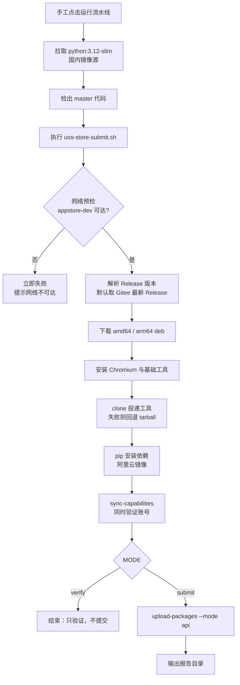

# 统信应用商店投递迁移到 Gitee Go 设计

## 1. 背景与问题

release 流程里有一个「自动把最新版本投递到统信应用商店」的环节，原先放在
GitHub Actions 的 `release.yml` 的 `update-uos-store` 任务中，调用第三方工具
`guanzi008/appstore` 完成提交。该任务在 GitHub Actions 上长期失败，原因不是账号
或包的问题，而是**网络链路**：

- 投递工具访问的商店开放平台是 `https://appstore-dev.uniontech.com`，属于国内服务；
- 工具的登录环节必须使用**无头 Chromium**（内部用 pyppeteer 打开登录页、输入账号、
  再把 Cookie / localStorage 导出给 requests 会话复用），不是纯 HTTP 登录；
- GitHub Actions 的运行器在境外，访问该平台的链路不可用，任务必然失败。

结论：这个环节要有国内出口的构建环境才能跑通。

## 2. 方案选型

| 方案 | 结论 | 原因 |
| --- | --- | --- |
| A. Gitee Go 云端容器（`execute@docker`） | **采用** | 构建节点在国内，能访问商店平台；每月有免费核分额度，够低频发版使用 |
| B. Gitee Go「主机纳管」跑在自有机器 | 否决 | 需要机器可被 Gitee 侧 SSH 接入，家用/办公网络不满足；且依赖个人机器在线 |
| C. 自建带 Chromium 的镜像并推到国内仓库 | 暂缓 | 更稳定，但需要额外维护镜像仓库；当前先用公共镜像 + 容器内安装 |
| D. 取消 CI，改本地脚本手工执行 | 否决 | 发版流程需要可追溯、可重复，手工执行容易漏步骤 |

## 3. 关键实测结论

以下结论均来自在 Gitee Go 上真实运行探测流水线得到的日志，不是推测：

1. **Docker Hub 不可用**：`image: "alpine:3.19"` 直接报
   `Back-off pulling image "alpine:3.19"`，Gitee Go 的构建节点无法直连 Docker Hub。
   改用国内镜像源 `docker.m.daocloud.io` 后可以正常拉取。
2. **容器是 root**，且 `apt-get` 可用（Debian 系镜像），因此可以在容器内安装
   Chromium 与运行库。
3. **网络可达性**（按探测顺序，1 表示可达）：
   - `appstore-dev.uniontech.com` 可达（这是本方案成立的前提）；
   - `gitee.com`、`github.com` 可达；
   - 官方 PyPI、Google 系域名不可达，必须显式使用国内镜像。
4. **流水线配置随代码版本化**：Gitee Go 会把流水线定义存成仓库内的
   `.workflow/<name>.yml`；反过来，直接往仓库 `.workflow/` 丢一个合法 YAML，
   Gitee Go 也会自动识别成流水线。因此配置文件可以放仓库、随 GitHub → Gitee 同步。
5. **手工触发可用**，且 `triggers` 段可以省略，从而避免 push 自动触发——
   这一点很重要：这条流水线会真实提交商店，不能被日常提交误触发。

## 4. 架构与文件职责

```
.workflow/uos-store-upload.yml        ← 薄壳：拉镜像 + 调用脚本（手工触发）
build/scripts/uos-store-submit.sh     ← 全部业务逻辑（下载产物、备环境、投递）
Gitee Go「通用变量」                    ← APPSTORE_USERNAME / APPSTORE_PASSWORD
Gitee Release 资产                     ← linglong-store_<版本>_{amd64,arm64}.deb
```

分层原则：**配置进仓库、逻辑进脚本、凭据进变量**。

- 流水线 YAML 只做转发，不做业务判断，改一行即懂；
- 脚本可以在本地用同样参数复现，便于排查；
- 凭据永不进仓库，只通过 Gitee Go 通用变量注入，密码使用「密文」类型。

## 5. 运行流程



`MODE` 是防止误提交的开关：脚本默认 `verify`，只有流水线显式传入 `submit`
才真正提交。因此「调试用流水线」和「正式提交流水线」是文件级隔离的。

## 6. 变量与凭据

| 名称 | 来源 | 说明 |
| --- | --- | --- |
| `APPSTORE_USERNAME` | Gitee Go 通用变量 | 商店开发者账号 |
| `APPSTORE_PASSWORD` | Gitee Go 通用变量（密文） | 商店开发者密码 |
| `RELEASE_TAG` | 可选变量 | 指定投递版本，留空取 Gitee 最新 Release |
| `MODE` | 流水线内写死 | `verify` / `submit` |
| `GITEE_REPO` | 脚本默认值 | 存放 deb 产物的仓库 |
| `APPSTORE_TOOL_REPO` | 脚本默认值 | 投递工具来源，日后可换 Gitee 私有镜像仓库 |
| `PIP_INDEX_URL` | 脚本默认值 | PyPI 镜像，默认阿里云 |

通用变量需要**在流水线编辑页显式关联**才会注入构建环境，创建变量本身不等于生效。

## 7. 操作手册

首次配置：

1. 确认 Gitee 仓库已开通 Gitee Go 流水线（仓库页面「流水线」入口可进入即可）；
2. 在「通用变量」中添加 `APPSTORE_USERNAME`、`APPSTORE_PASSWORD`（密码勾选密文）；
3. 打开 `ustore-store-upload` 流水线（由 `.workflow/uos-store-upload.yml` 自动出现），
   在编辑页关联上述两个变量并保存；
4. 确认目标版本的 Gitee Release 已包含 amd64 / arm64 的 deb 资产。

每次发版：

1. 走完既有 release 流程，产物同步到 Gitee Release；
2. 打开流水线页面，点「运行」；
3. 观察日志：`sync-capabilities` 通过表示账号与网络正常；`upload-packages` 输出报告
   表示提交成功。

## 8. 边界与风险

- **工具无 LICENSE**：`guanzi008/appstore` 仓库未声明开源许可，因此不能把它的代码
  复制进本仓库；当前采用运行时 clone（可切换到自建 Gitee 私有镜像仓库）。若后续要
  内置，需要先与作者确认授权。
- **Chromium 依赖较重**：每次运行都要在容器内准备 Chromium，首次运行较慢；
  若后续想提速，可自建预装 Chromium 的镜像并推到国内仓库。
- **凭据轮换**：商店密码变更后只需改 Gitee Go 通用变量，不需要改代码。
- **不自动触发**：流水线不做 push/tag 自动触发，避免把未验证的产物提交到商店。

## 9. 验证清单

- [ ] 容器能拉取 `docker.m.daocloud.io` 镜像
- [ ] `appstore-dev.uniontech.com` 预检通过
- [ ] deb 产物下载成功且非空
- [ ] Chromium 可用，`sync-capabilities` 登录成功
- [ ] `MODE=verify` 运行不会产生任何提交
- [ ] `MODE=submit` 能产出报告并完成提交
